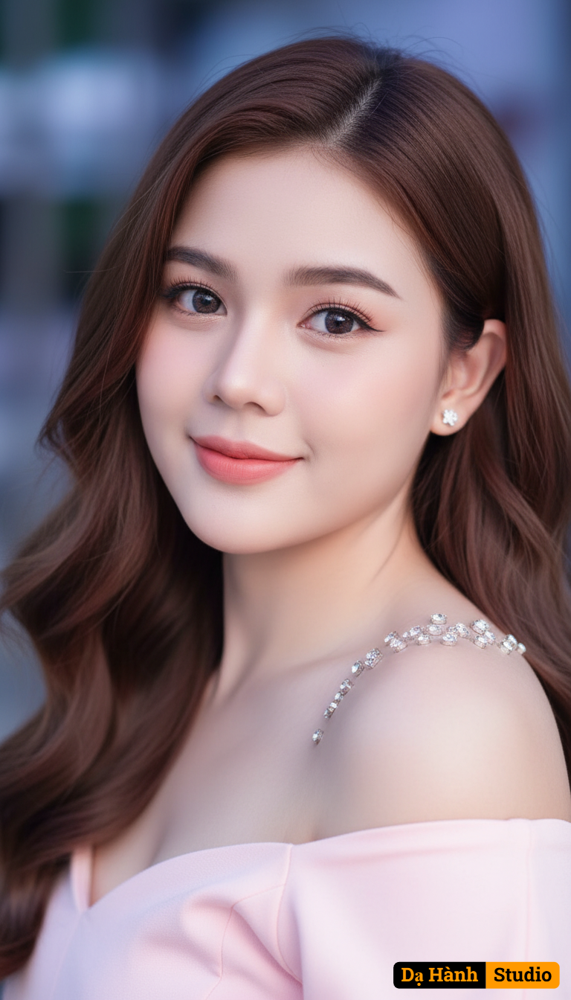

# AI Generated Image

## Details
- **Prompt:** `Use a reference image to preserve the natural identity and facial likeness with high fidelity. The image created must maintain authenticity, liveliness and avoid any artificial or cartoonish appearance, retaining 100% of the facial features.
Subject Details: A young Asian woman with long, wavy, chestnut brown hair cascading over her shoulders. She has smooth skin, large, sparkling eyes with delicate eyeliner, curled lashes, and fresh peach-pink lips, displaying a gentle smile. She is wearing small sparkling earrings and a cluster of gems or sparkling embellishments around her neck, gracefully resting on her shoulder. She is dressed in a light pink, gently off-the-shoulder top, revealing part of her collarbone. She looks directly at the viewer with an adorable, sweet expression.
Lighting: Soft, diffused light, possibly from the front and sides. The background features cool-toned light (blue/purple hues), while maintaining warm and bright tones for the subject. The light highlights the sparkling details of her jewelry.
Technique: Medium-shot or close-up lens, high sharpness focused on the face, hair, and jewelry. Medium contrast, bright, vibrant colors. Beauty portrait photography style, sweet and romantic.
Emotion: The overall mood is sweet, adorable, gentle, and elegant`
- **Category:** Nhân vật
- **Source Image:** [View Source](https://raw.githubusercontent.com/lenzcomvth/ImageLibrary/main/Female.png)

## Image
