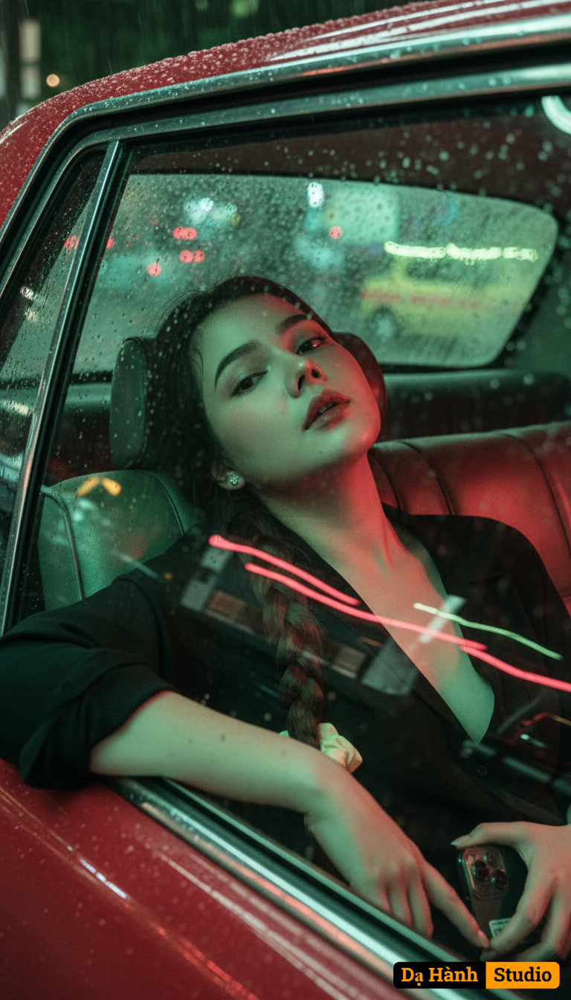

# AI Generated Image

## Details
- **Prompt:** `Chân dung hiện thực theo phong cách điện ảnh của Vương Gia Vệ Sử dụng ảnh đã tải lên làm tham chiếu, làm nổi bật đường viền hàm và cổ để tạo vẻ ngoài uy nghiêm, đồng thời vẫn giữ nguyên hình dạng và bản sắc của khuôn mặt. Tư thế: Ngồi tựa đầu vào cửa sổ, tay đặt trên mép cửa, ánh đèn đường chiếu qua. Bối cảnh: Bên trong một chiếc taxi cũ với ghế da bạc màu, kính mờ đi vì mưa và ánh sáng đèn đường khúc xạ thành những vệt mờ. Góc máy: Chụp từ bên ngoài cửa sổ, với những hình ảnh phản chiếu chồng lên nhau trên khuôn mặt. Ánh sáng: Đèn neon đỏ-xanh lá cây lướt qua, khiến khuôn mặt đổi màu theo ánh sáng. Trang phục: Áo sơ mi đen cài cúc, hơi mở, tóc trông ẩm. Tông màu ảnh: Độ tương phản đỏ-xanh lá cây, hạt phim dày, chuyển động mờ rõ rệt và ánh sáng mờ ảo xung quanh đèn pha của xe. Tâm trạng: anh đơn, tĩnh mịch, cảm giác về một thành phố lớn không có tiếng nói trả lời.''cầm iphone 17 pro max`
- **Category:** Nhân vật
- **Source Image:** [View Source](https://raw.githubusercontent.com/lenzcomvth/ImageLibrary/main/Female.png)

## Image
