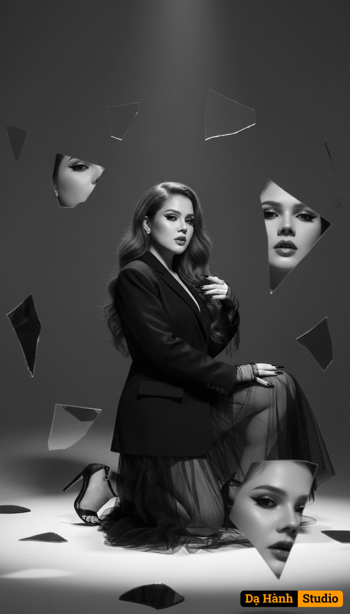

# AI Generated Image

## Details
- **Prompt:** `Hyperrealistic black and white editorial portrait of a young woman with the same facial features as the reference photo. She kneels dramatically under a single intense spotlight in a minimalist cinematic setting.
Her long, wavy red hair frames her face. Makeup: bold black eyeliner, voluminous eyelashes, sculpted eyebrows, luminous and defined skin, and dark, glossy lips. Long, pointy black nails. She wears an oversized black blazer over a floor-length, sheer black tulle skirt, sheer fringed gloves, and high-heeled sandals.
Around her, dozens of broken mirror shards float in the air, reflecting fragments of her face, eyes, lips, and hands. Some fragments appear blurry in the foreground, others sharp near her silhouette, creating a surreal, dreamlike composition.
The lighting is dramatic chiaroscuro: bright flashes at the edges of the glass, deep shadows elsewhere. The atmosphere is symbolic, surreal, and editorial-like. Ultra-detailed cinematic focus, 8K hyperrealism`
- **Category:** Nhân vật
- **Source Image:** [View Source](https://raw.githubusercontent.com/lenzcomvth/ImageLibrary/main/Female.png)

## Image
