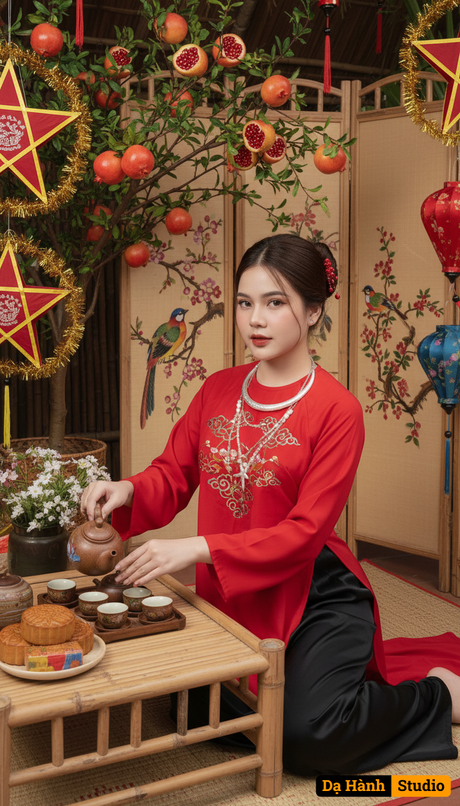

# AI Generated Image

## Details
- **Prompt:** `A youthful Vietnamese woman (using the reference face from the uploaded image) with a slender figure, her hair neatly tied in a bun adorned with red jewelry pieces. She wears elegant makeup with soft pink lipstick and a gentle blush, creating a fresh and natural look. She is dressed in a traditional youthful red áo yếm made from luxurious high-quality fabric with exquisite embroidery, paired with a flowing red robe and black silk trousers. Around her neck are traditional silver necklaces, radiating a blend of tradition and modernity.
She sits gracefully beside a low bamboo tea table, pouring tea from a brown ceramic teapot into small cups. The scene is decorated with a pomegranate tree heavy with fruit, a bamboo folding screen painted with birds and flowers, and colorful Mid-Autumn Festival lanterns illuminating the space. On the tea table lie traditional mooncakes, symbolizing reunion.
The atmosphere harmoniously blends the youthful elegance of a Vietnamese maiden with the warm, festive spirit of the Mid-Autumn Festiva`
- **Category:** Nhân vật
- **Source Image:** [View Source](https://raw.githubusercontent.com/lenzcomvth/ImageLibrary/main/Female.png)

## Image
