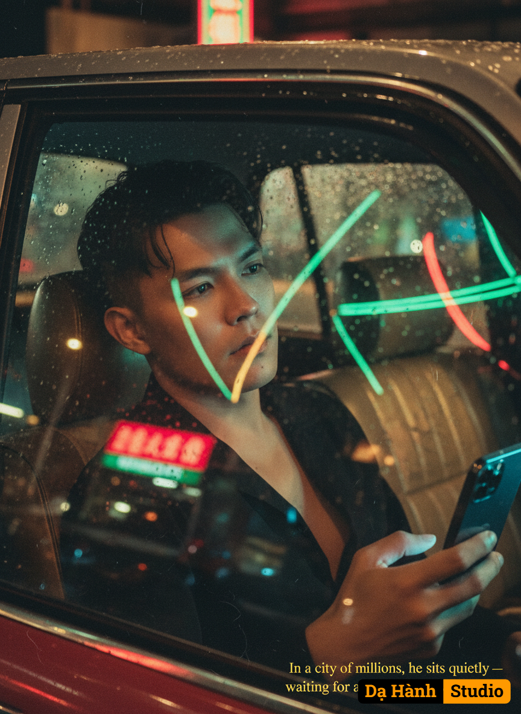

# AI Generated Image

## Details
- **Prompt:** `Tạo hình ảnh chân dung nam mang phong cách điện ảnh đặc trưng của Vương Gia Vệ — trữ tình, cô đơn và đầy chất thơ của đô thị đêm. Hình ảnh phải gợi cảm giác tĩnh mịch, một khoảnh khắc lặng lẽ giữa dòng đời chuyển động, với ánh sáng neon đan xen và bầu không khí ẩm ướt, phản chiếu.

🧍‍♂️ Nhân vật chính

Giới tính: Nam

Tư thế: Ngồi tựa đầu vào cửa sổ, tay đặt trên mép cửa taxi, ánh mắt hướng ra ngoài như đang đắm chìm trong dòng suy nghĩ.

Biểu cảm: Trầm lặng, suy tư, ánh mắt lơ đãng, gợi cảm giác cô đơn giữa đêm thành phố.

Kiểu tóc: Iver large – tóc hơi dài, rũ tự nhiên, vuốt phồng nhẹ tạo cảm giác lãng tử, hơi ẩm vì mưa hoặc hơi nước trong xe.

Trang phục:

Áo sơ mi đen cài cúc, cổ hơi mở, tạo nét chững chạc nhưng vẫn phóng khoáng.

Cổ và đường viền hàm được làm nổi bật, thể hiện sự uy nghiêm, góc cạnh.

Tay cầm iPhone 17 Pro Max, ánh sáng từ màn hình phản chiếu nhẹ lên khuôn mặt.

Tổng thể khuôn mặt: Giữ nguyên bản sắc và hình dạng khuôn mặt từ ảnh tham chiếu, chỉ làm nổi bật các chi tiết ánh sáng và khối để tăng chiều sâu điện ảnh.

🚖 Bối cảnh

Không gian bên trong một chiếc taxi cũ:

Ghế da bạc màu, bề mặt hơi nứt, ánh sáng phản chiếu tạo cảm giác cũ kỹ.

Kính xe mờ đi vì mưa, những giọt nước trượt dài, khúc xạ ánh đèn đường bên ngoài thành những vệt sáng mờ chồng lên khuôn mặt nhân vật.

Không khí ẩm, ánh sáng loang lổ, hơi nước và phản chiếu tạo chiều sâu.

Góc máy:

Chụp từ bên ngoài cửa sổ taxi, để thấy hình ảnh phản chiếu của thành phố và đèn neon hòa cùng khuôn mặt nhân vật.

Cảm giác như khán giả đang nhìn vào một khoảnh khắc riêng tư qua lớp kính mưa.

💡 Ánh sáng & màu sắc

Nguồn sáng chính:

Đèn neon đỏ và xanh lá cây lướt qua kính, làm khuôn mặt thay đổi màu sắc theo từng nhịp ánh sáng.

Một phần ánh sáng yếu từ đèn đường, mờ và tán xạ qua kính mưa.

Hiệu ứng hình ảnh:

Hạt phim dày (film grain rõ), gợi phong cách điện ảnh Hong Kong thập niên 1990.

Chuyển động mờ nhẹ (motion blur) của khung cảnh bên ngoài, như taxi đang lướt đi.

Ánh sáng đèn pha xe phía trước tạo hiệu ứng mờ ảo xung quanh khung hình.

Tông màu tổng thể:

Tương phản mạnh giữa đỏ và xanh lá, xen lẫn ánh vàng từ đèn đường xa.

Màu ảnh ấm, đượm buồn, gợi cảm giác hoài niệm, cô đơn.

🎭 Tâm trạng & cảm xúc

Không khí tĩnh mịch, lẻ loi giữa thành phố lớn – như một người tìm kiếm câu trả lời giữa đêm mưa nhưng chẳng có tiếng nói nào đáp lại.

Cảm giác đơn độc nhưng đẹp đẽ, gợi nhớ đến những nhân vật trong “In the Mood for Love” hoặc “Chungking Express” của Vương Gia Vệ — nơi ánh sáng và nỗi buồn hòa quyện.

✍️ Chi tiết bổ sung (tùy chọn)

Có thể thêm chữ ký hoặc caption phong cách phim Vương Gia Vệ ở góc dưới ảnh (chữ vàng mảnh, kiểu serif thanh thoát), ví dụ:

"In a city of millions, he sits quietly — waiting for a voice that never comes."

📷 Yêu cầu kỹ thuật khi tạo ảnh:

Giữ nguyên đặc điểm nhận dạng khuôn mặt từ ảnh tham chiếu.

Làm nổi bật đường viền hàm, cổ, ánh sáng phản chiếu thực tế.

Duy trì tông điện ảnh đỏ–xanh, film grain dày, và hiệu ứng phản chiếu kính mưa rõ nét.`
- **Category:** Nhân vật
- **Source Image:** [View Source](https://raw.githubusercontent.com/lenzcomvth/ImageLibrary/main/Male.png)

## Image
