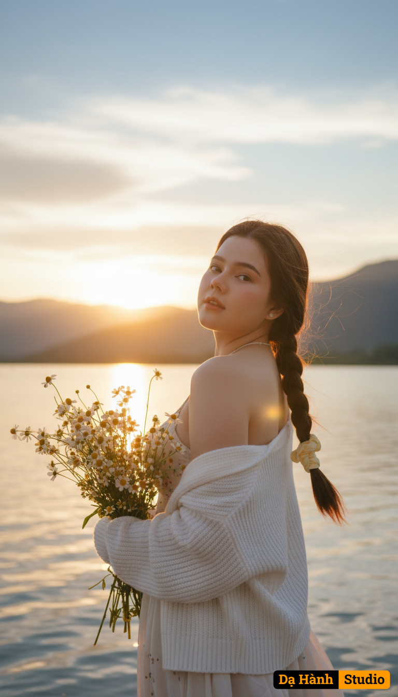

# AI Generated Image

## Details
- **Prompt:** `Cinematic realistic female portrait at golden sunset by the lakeside
Using the uploaded photo as reference, keeping the hairstyle, facial expression, and outfit style.
Pose: The woman turns her head slightly back toward the camera, holding a bouquet of flowers in one hand. Her gaze is soft yet captivating, as the wind gently lifts strands of her hair.
Setting: Lakeside at sunset — warm golden light reflects on the water’s surface, surrounded by mountains in the distance. The sky burns in orange and pink hues blending into soft blue clouds, creating a dreamy evening glow.
Camera angle: Medium shot from behind at waist level, slightly tilted upward to capture both the subject and the vivid sky.
Lighting: Natural golden-hour light, with warm tones illuminating her face and the bouquet. Subtle rim light around her hair and sweater to enhance depth and softness.
Outfit: White knitted sweater draped over a light flowy dress, creating a cozy, romantic, slightly vintage vibe that matches the sunset tones.
Image tone: Warm cinematic palette — orange, gold, and cream highlights; soft halation glow; fine film grain; shallow depth of field for dreamy focus.
Mood: Peaceful, nostalgic, and romantic — capturing a quiet moment of beauty in the fading light, as if time slowed down at the edge of the sunset.`
- **Category:** Nhân vật
- **Source Image:** [View Source](https://raw.githubusercontent.com/lenzcomvth/ImageLibrary/main/Female.png)

## Image
