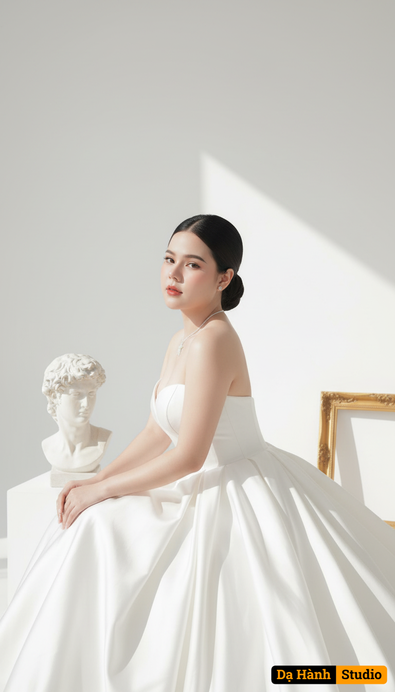

# AI Generated Image

## Details
- **Prompt:** `Preserve the face from the uploaded image. An ultra-sharp 8K studio portrait of an elegant and sophisticated East Asian bride. She sits gracefully with a gentle side tilt, her expression calm and serene, exuding refined elegance and artistic charm. She wears a strapless white ball gown made of high-quality satin, delicately pleated and spreading widely around her. She wears no tiara, keeping the look minimalist and modern. Her long black hair is neatly styled in a low bun, revealing her facial features and creating a pure, graceful impression. The background is a bright, minimalist white studio, featuring a classical Greek sculpture and a golden picture frame beside her, adding an artistic and luxurious touch. Strong white light shines from the side, casting soft shadows and well-defined contours that highlight the texture of the satin gown and the curves of her face. The overall mood is elegant, artistic, refined, and poetic. The style reflects fine art wedding photography — a harmoni`
- **Category:** Nhân vật
- **Source Images:**
  - [View Source](https://raw.githubusercontent.com/lenzcomvth/ImageLibrary/main/Female.png)

## Image
