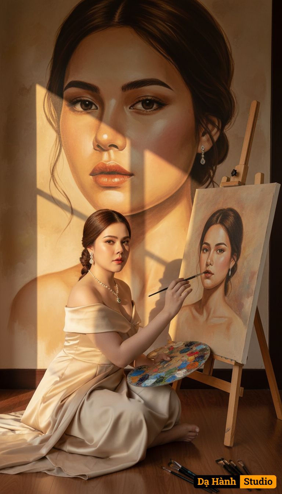

# AI Generated Image

## Details
- **Prompt:** `Ultra realistic 8K fine art photography, same reference girl (lock face identity, preserve exact vector face from reference photo, no alteration), elegant cinematic scene.
A graceful woman in a champagne beige off-shoulder silk gown, wearing a luxurious gemstone necklace and earrings, sitting on the floor by a sunlit wall. She is painting her own portrait on a canvas, while a large painted mural of her face is behind her on the wall.
Sunlight streams through a window, casting warm golden rays and soft square shadows on the wall, creating a nostalgic and artistic atmosphere.
On the floor lies a painter’s palette with vivid oil paints and brushes, emphasizing the creative studio environment.
The composition shows three layers: the real woman, the canvas portrait, and the mural — blending reality and art in a surreal yet elegant way.

Style modifiers: ultra realistic, 8K, cinematic lighting, warm golden sunlight, artistic fine art photography, surreal realism, elegant feminine, painterly atmosphere.`
- **Category:** Nhân vật
- **Source Images:**
  - [View Source](https://raw.githubusercontent.com/lenzcomvth/ImageLibrary/main/Female.png)

## Image
