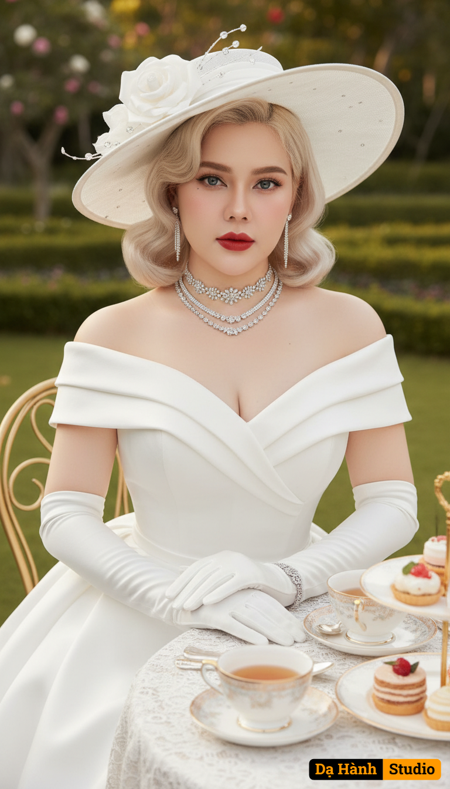

# AI Generated Image

## Details
- **Prompt:** `Use the reference photo to preserve the identity and likeness of the face with high fidelity. The generated image should keep the same recognizable facial features as the reference, maintaining photorealistic accuracy, without altering the person’s identity.

A refined elegant woman styled in an all-white couture gown made of premium luxury fabric. The off-shoulder dress features structured folds at the neckline, fitted tailoring, and a silhouette that enhances timeless grace. She wears white gloves and a wide-brimmed hat decorated with a sculptural rose and crystal embellishments.

Her accessories include a layered diamond choker necklace, long diamond earrings, and a bracelet, radiating sophistication. Her platinum blonde curls styled in retro waves, bold red lips, and piercing blue eyes create an aura of luxury and allure.

The setting is a high-society tea scene with porcelain teaware edged`
- **Category:** Nhân vật
- **Source Images:**
  - [View Source](https://raw.githubusercontent.com/lenzcomvth/ImageLibrary/main/Female.png)

## Image
