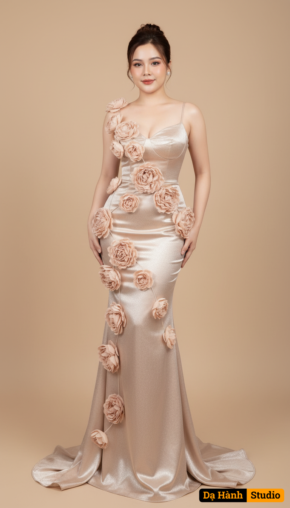

# AI Generated Image

## Details
- **Prompt:** `This is a high-resolution artistic photograph of a woman standing gracefully against a plain beige background, designed to highlight her presence. She is dressed in a floor-length, form-fitting gown crafted from luxurious satin silk, shimmering subtly with every movement. The gown, valued at nearly 2 billion VND, is not just a dress but a true piece of art, symbolizing elegance and opulence. Its fitted bodice and delicate straps embrace her figure, while cascading layers of oversized, three-dimensional fabric flowers—soft and voluminous like blooming peonies—flow from her shoulders down to her torso, creating a dramatic yet romantic impression.

Her hair is styled in a refined updo, with a few loose strands framing her face, softening the overall look. Makeup is kept natural, with luminous skin, rosy lips, and a gentle touch on the eyes, enhancing her delicate beauty without overwhelming it. The serene smile she wears, combined with her poised expression, exudes both confidence and grace.

Soft, even lighting casts gentle shadows, bringing out the silky sheen of the fabric, the fluffy texture of the flowers, and the smoothness of her complexion. The minimalist background creates balance, ensuring that all focus remains on her presence and the masterpiece of a gown she wears. This photograph goes beyond fashion—it captures sophistication, femininity, and timeless allure.`
- **Category:** Nhân vật
- **Source Images:**
  - [View Source](https://raw.githubusercontent.com/lenzcomvth/ImageLibrary/main/Female.png)

## Image
