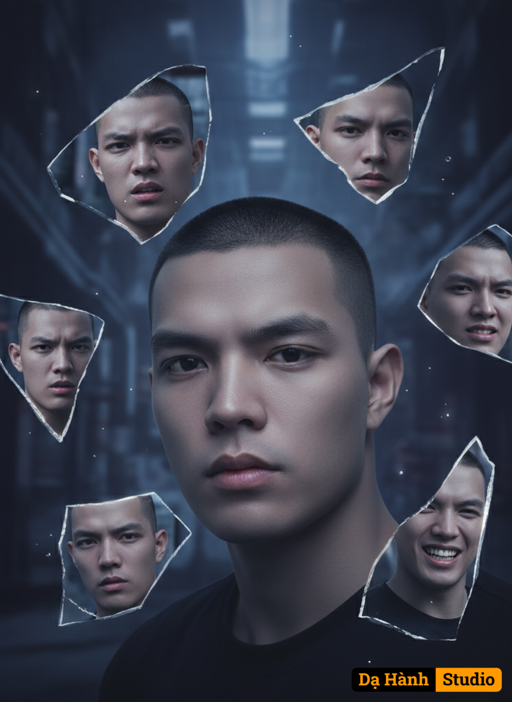

# AI Generated Image

## Details
- **Prompt:** `Transform the uploaded image (preserving the exact facial details) into a surreal conceptual portrait of a young man with a serious expression, holding fragments of broken mirrors floating in midair. Each shard reflects a different emotion — calmness, anger, sadness, contemplation, and joy — all portrayed by the same person. The background should be moody and somber, with cinematic lighting emphasizing the facial features, emotional depth, and psychology, symbolizing fractured identity and inner conflict. Surreal, soft shadows.`
- **Category:** Nhân vật
- **Source Images:**
  - [View Source](https://raw.githubusercontent.com/lenzcomvth/ImageLibrary/main/Male.png)

## Image
