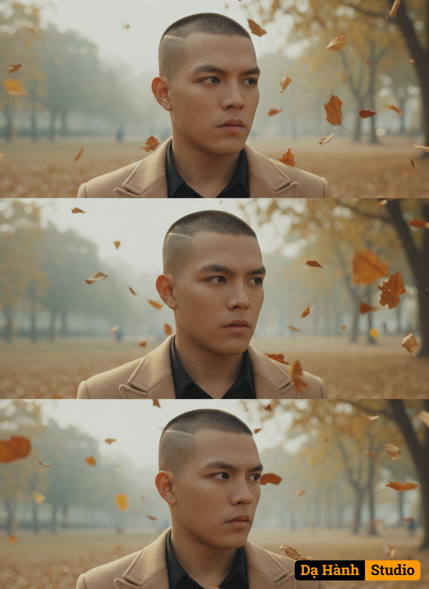

# AI Generated Image

## Details
- **Prompt:** `A trio of close-up portraits of a young man, arranged vertically, set against a hazy autumn sky with fallen dry leaves. Natural light and diffused breath, giving the painting a cinematic and heartwarming feel.

**Subject Description:**
The subject is a young man. He has light olive to light golden skin. His hair is thick, black, styled youthfully, slightly messy with bangs partially covering his hair. He is the arguable arbiter or the one in the heated debate. His eyes are slightly out of the lens, looking down or to the side.

**Clothes and Appearance:**
He is wearing a black button-down shirt under a stylish overcoat. The jacket is beige

**Setting and Background:**
The background is blurred (bokeh), pointed for shallow depth of field. The painting features an outdoor setting, possibly a park or a wooded area, with soft colors of leaves such as yellow, brown and green. The main Visual Element in the foreground and midground of all three panels is the scattered, dry, brown or burnt orange leaves that appear to be falling, creating a lively, airy atmosphere around the house.

**Details of each panel:**

1. **Top Panel:** The man is looking slightly off to the right (viewer's left), with a suggestive, plump expression. Fallen leaves surround the top and sides of his head. 2. **Middle Panel:** This photo is very similar, perhaps a little closer, with the man's gaze turned slightly downwards. The expression is pensive or thoughtful. More fallen leaves can be seen closer to his face.

3. **Bottom Panel:** The man is looking sharply to the right (viewer's left). A slightly different angle, highlighting the jawline and the serious look of the mouth. Falling leaves stand out in the foreground and midground.

The overall image is aesthetically pleasing, with a professional feel, perhaps a film still or a fashion editorial, emphasizing the mood and the season.Prompt written and edited by trungayai`
- **Category:** Nhân vật
- **Source Images:**
  - [View Source](https://raw.githubusercontent.com/lenzcomvth/ImageLibrary/main/Male.png)

## Image
