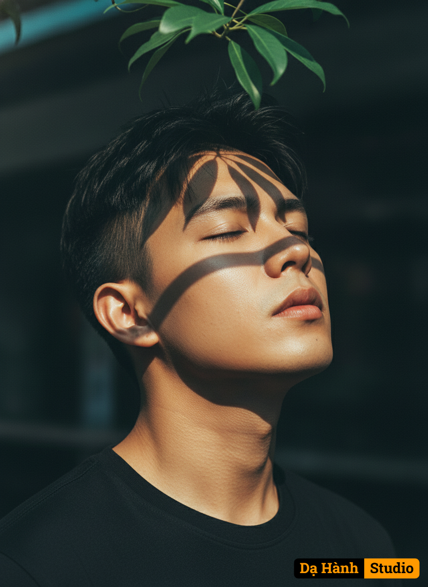

# AI Generated Image

## Details
- **Prompt:** `Ultra photoreal cinematic close-up portrait of a young man, head tilted to the right in a refined three-quarter angle, chin slightly raised upward with eyes closed, serene yet stylish expression. Natural realistic warm skin tone with detailed texture, illuminated by dramatic sunlight. Short black layered hair, slightly messy on top, sides neatly clipped. Wearing a plain black crew-neck T-shirt. Real sharp green foliage above the head, sunlight cutting through leaves and projecting distinct artistic shadows onto the face: a horizontal stripe across the eyes and brows, a vertical line from forehead to nose bridge, and irregular patches across the cheek. Lighting is cinematic, high-contrast: golden highlights on the raised nose, lips, and jawline balanced with cool teal-toned shadows. Background is dark, softly blurred, evoking a cinematic depth-of-field. Fine-art editorial photography style, luxurious and dramatic mood, 8k ultra-detailed, cinematic color grading (teal & orange).`
- **Category:** Nhân vật
- **Source Images:**
  - [View Source](https://raw.githubusercontent.com/lenzcomvth/ImageLibrary/main/Male.png)

## Image
