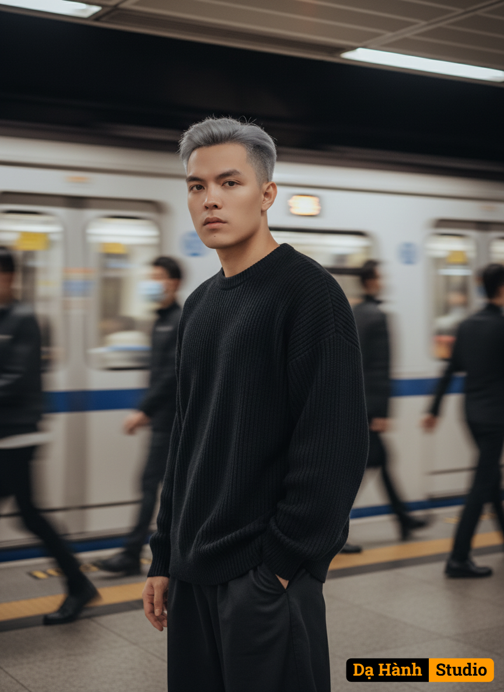

# AI Generated Image

## Details
- **Prompt:** `A young man with fair skin and sharp facial features, standing in a subway station. His body is turned slightly to the side in a relaxed 3/4 angle, with his left shoulder closer to the camera, while his face is turned toward the lens, looking directly with a calm and serious expression. He has short, neat, silver-gray hair styled naturally. He wears an oversized black sweater and black pants, with his right hand casually placed in his pocket. The background shows a subway train in motion, blurred with motion blur, and several blurred figures walking past, emphasizing movement. The subject is in sharp focus, highlighted against the blurred surroundings. Lighting is artificial from neon lights in the station, giving a slightly warm yet cinematic atmosphere. The overall style is urban street photography, minimalistic, cinematic, high-quality, with sharp details on the subject and strong motion blur effect for the background.`
- **Category:** Nhân vật
- **Source Images:**
  - [View Source](https://raw.githubusercontent.com/lenzcomvth/ImageLibrary/main/Male.png)

## Image
