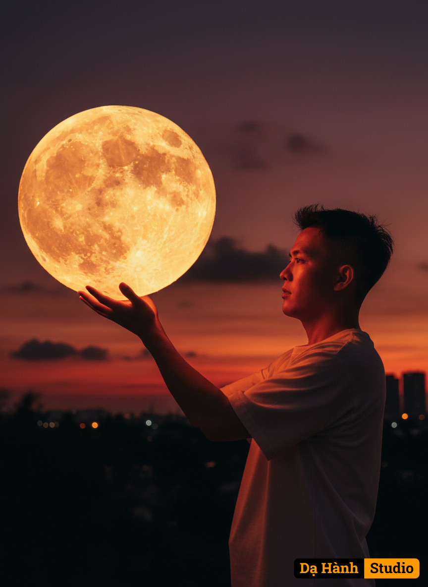

# AI Generated Image

## Details
- **Prompt:** `Cinematic photoreal portrait, vertical composition, vivid saturated colors. A young man standing outdoors at sunset, waist-up, on the right third of the frame, in profile facing left. He lifts a giant glowing full moon with both hands, palms supporting its underside, fingers spread. The moon is oversized, occupying the upper-left quadrant, glowing intensely golden-orange, with bold visible craters and texture, radiating strong light. The man wears a loose, plain short-sleeve t-shirt in light beige-grey. His skin and face are illuminated by a deep warm orange rim light from the glowing moon. Hair is short, dark, slightly tousled.
Background: dramatic saturated twilight sky, deep fiery orange and rich crimson-red near the horizon, blending upward into dark violet-purple. Low dark clouds visible, horizon silhouettes of trees and buildings in pure black, with a few tiny glowing bokeh lights.
Lighting & style: cinematic golden-hour tones, high saturation, high contrast, dramatic and dreamy, strong warm highlights from the moon, deep shadows for silhouette effect, photorealistic rendering, poetic atmosphere`
- **Category:** Nhân vật
- **Source Images:**
  - [View Source](https://raw.githubusercontent.com/lenzcomvth/ImageLibrary/main/Male.png)

## Image
