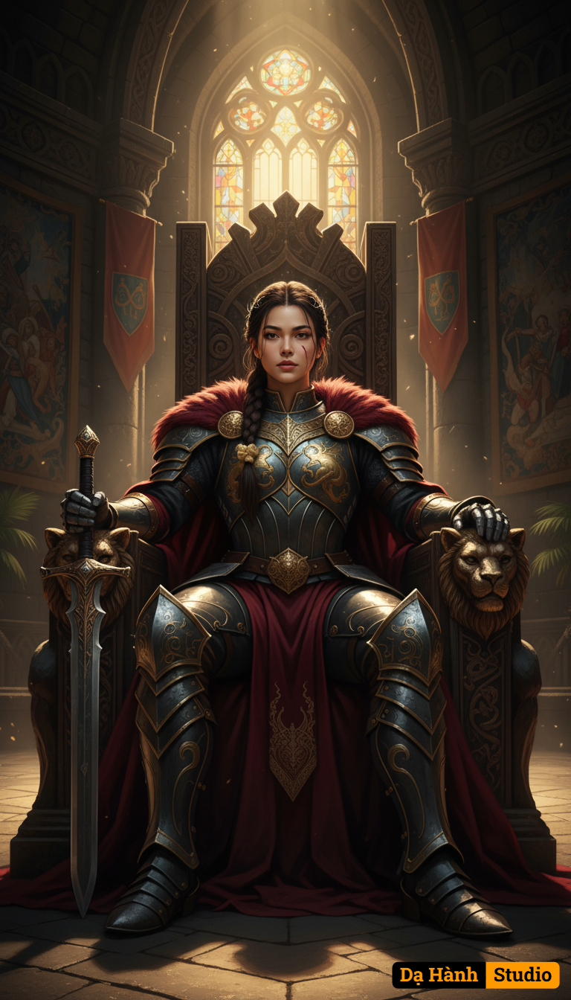

# AI Generated Image

## Details
- **Prompt:** `A formidable warrior queen sits upon her massive, imposing throne, her posture radiating stoic power and ancient majesty. She is depicted in a full-body shot, slightly angled upwards to emphasize her commanding presence, centered within a vast, high-ceilinged throne room built of colossal dark stone, its walls adorned with weathered tapestries depicting heroic sagas. Her attire is a masterful blend of ornate, functional battle-worn plate armor in obsidian and burnished gold, adorned with intricate, hand-hammered designs depicting mythological beasts, a heavy, deep crimson, fur-lined cloak draped dramatically over her shoulders. Her strong, resolute face, framed by dark, intricately braided hair and a simple, powerful iron circlet, gazes directly forward, revealing a single faint scar across her cheek as a testament to past battles. A massive, bejeweled broadsword leans against the armrest of her throne, which is carved from dark, ancient wood and adorned with raw, unpolished obsidian and gilded leonine motifs, appearing more like a monument than a seat. Dramatic, volumetric golden light streams in from a colossal, arched stained-glass window high above and to the left, casting long, sharp shadows across the textured stone floor and illuminating dust motes dancing in the air, creating a chiaroscuro effect that highlights her armor and the intricate details of the throne while leaving the distant corners of the opulent, banner-draped hall in deep, mysterious shadow. The dominant color palette consists of deep reds, charcoal grays, burnished golds, and metallic silvers, with hints of vibrant jewel tones from the stained glass, all rendered in an epic, hyperrealistic fantasy art style, with an emphasis on rich textures and cinematic depth of field.`
- **Category:** Nhân vật
- **Source Images:**
  - [View Source](https://raw.githubusercontent.com/lenzcomvth/ImageLibrary/main/Female.png)

## Image
