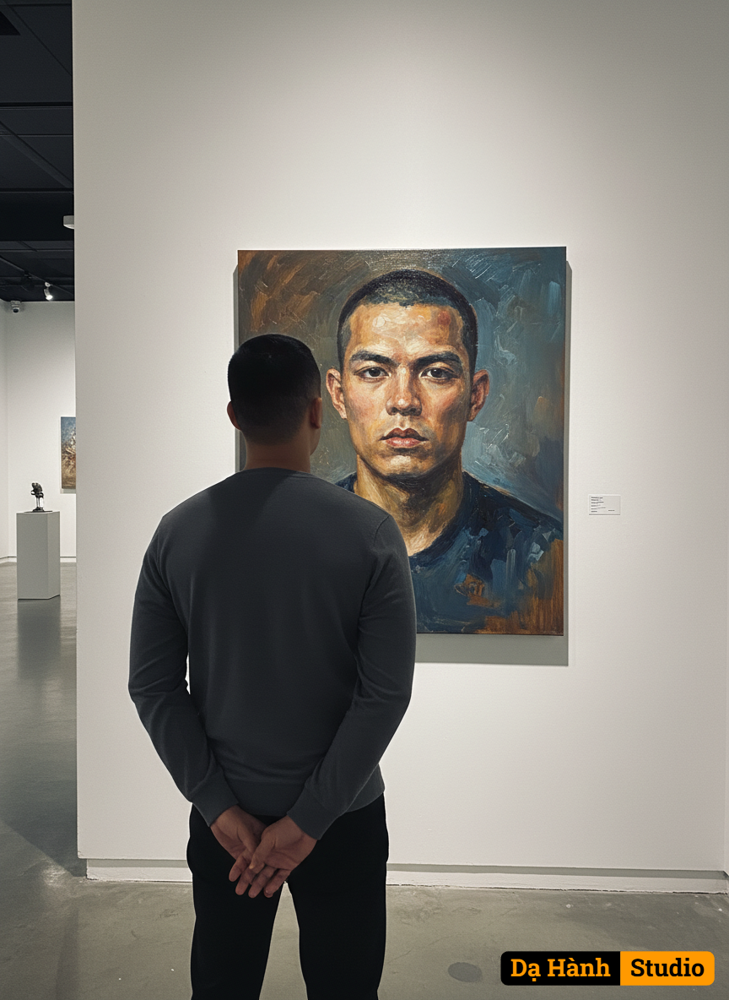

# AI Generated Image

## Details
- **Prompt:** `Using the attached image as reference for the man’s face and appearance, create a scene where he is standing in a modern art gallery, seen from behind, looking at a large oil painting portrait of himself on the wall. The painting should depict the same man in a realistic expressive oil-painting style, showing his face and upper body with textured brush strokes and muted colors. The gallery wall is clean and white with a soft spotlight illuminating the artwork, creating a professional exhibition atmosphere.`
- **Category:** Nhân vật
- **Source Images:**
  - [View Source](https://raw.githubusercontent.com/lenzcomvth/ImageLibrary/main/Male.png)

## Image
