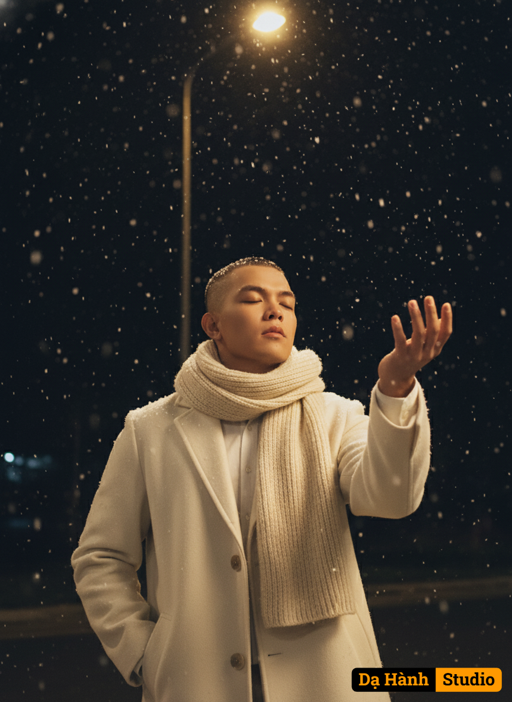

# AI Generated Image

## Details
- **Prompt:** `A cinematic, hyper-realistic winter portrait of the subject standing under softly falling snow at night. The subject wears an elegant ivory-white coat and a large soft scarf wrapped warmly around the neck. The left hand rests inside the coat pocket, while the right hand is gently extended forward with the palm open, as if catching snowflakes. The head tilts slightly upward with a calm, serene, and reflective expression, feeling the snow melt against the skin. A warm yellow streetlight above casts a gentle golden halo around the subject’s hair and shoulders, contrasting beautifully with the deep black night sky filled with softly glowing snowflakes. The atmosphere is romantic, dreamlike, and poetic, evoking the mood of a cinematic winter movie scene. Soft, detailed lighting enhances texture and depth, while the snow adds motion and emotional warmth. Editorial fashion photography style, ultra-detailed, realistic texture, 8K quality. Face-Lock 100%, Hair-Lock 100%, Outfit-Lock 100%. Aspect Ratio 9:16, vertical portrait format.`
- **Category:** Nhân vật
- **Source Images:**
  - [View Source](https://raw.githubusercontent.com/lenzcomvth/ImageLibrary/main/Male.png)

## Image
