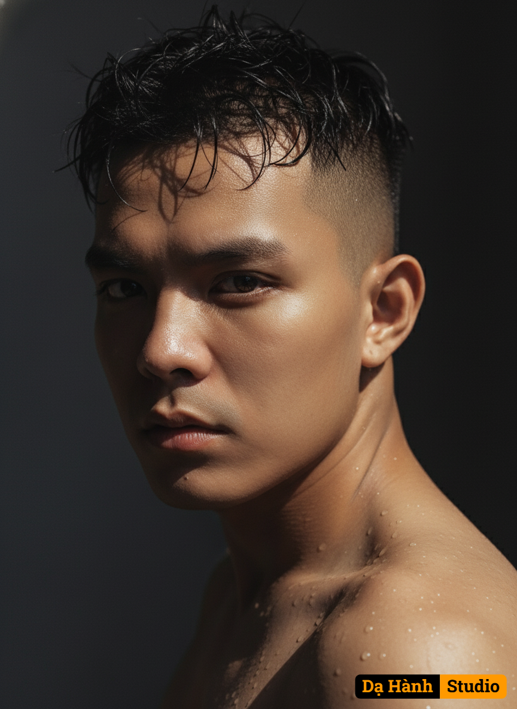

# AI Generated Image

## Details
- **Prompt:** `Use the uploaded photo as reference and keep the exact facial structure and distinctive features of the person in the image. Change the overall style and atmosphere of the subject while preserving their natural identity. Create artistic messy hair with a 3/4 angle view. Add natural water droplets on the face and bare shoulders softly illuminated by sunlight, creating an artistic and dramatic feeling. Half of the face should be in deep shadow, while the other half is brightly lit, forming a strong contrast between light and dark. The eyes should appear deep, emotional, and intense. Use a cinematic composition with a dark background, high-contrast lighting, and ultra-high resolution, resulting in a powerful and striking portrait.`
- **Category:** Nhân vật
- **Source Images:**
  - [View Source](https://raw.githubusercontent.com/lenzcomvth/ImageLibrary/main/Male.png)

## Image
