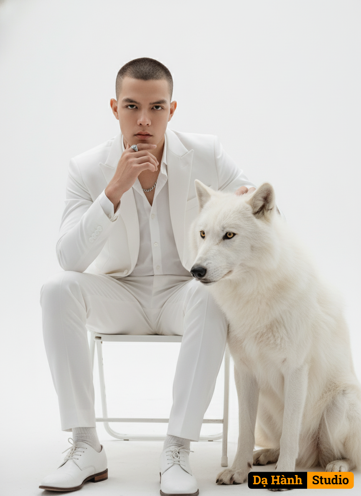

# AI Generated Image

## Details
- **Prompt:** `In a pristine white studio, the close-up shot focuses on a young man seated on a minimalist white folding chair. He wears a tailored white suit with a crisp white shirt underneath, slightly unbuttoned. Around his neck rests a delicate silver chain, while a polished silver ring gleams on his finger, reflecting the studio’s soft light. His pose exudes elegance: one elbow rests on his knee, the hand with the ring placed beneath his chin, revealing a cold expression with deep, mysterious eyes. Beside him sits a majestic white wolf, its sharp gaze and powerful presence captured fully within the frame. His other hand rests gently on the wolf’s head, symbolizing both connection and authority. A glimpse of sleek white Oxford shoes peeks into the frame, subtly completing the refined look. The entire scene is bathed in soft lighting, enhancing the purity of the white backdrop and chair, harmonizing with the man’s commanding aura and the wolf’s dignified presence.`
- **Category:** Nhân vật
- **Source Images:**
  - [View Source](https://raw.githubusercontent.com/lenzcomvth/ImageLibrary/main/Male.png)

## Image
