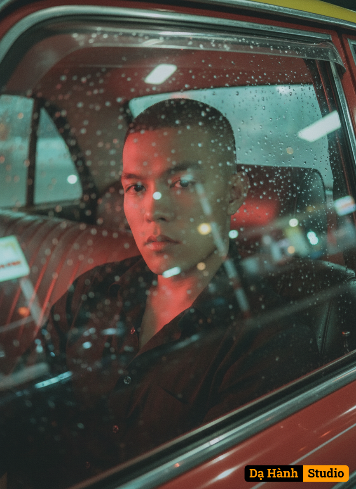

# AI Generated Image

## Details
- **Prompt:** `Wong Kar-wai cinematic-style realistic portrait. Using the uploaded photo as reference, preserve the subject’s true facial identity and proportions. Pose: Sitting inside an old taxi, head gently leaning against the fogged window. Setting: Interior of a vintage taxi with worn leather seats, rain droplets on the window, and refracted streetlights creating blurred light trails. Camera Angle: Shot from outside the window, showing overlapping reflections on the subject’s face. Lighting: Passing red and green neon lights cast shifting hues on the face, enhancing mood and depth. Outfit: Black button-down shirt slightly unbuttoned; hair appears naturally damp. Image Tone: Strong red–green contrast, heavy film grain, mild motion blur, and a hazy glow from the vehicle’s headlights. Mood: Evokes loneliness and quiet solitude — the feeling of a sleepless city with no reply.`
- **Category:** Nhân vật
- **Source Images:**
  - [View Source](https://raw.githubusercontent.com/lenzcomvth/ImageLibrary/main/Male.png)

## Image
