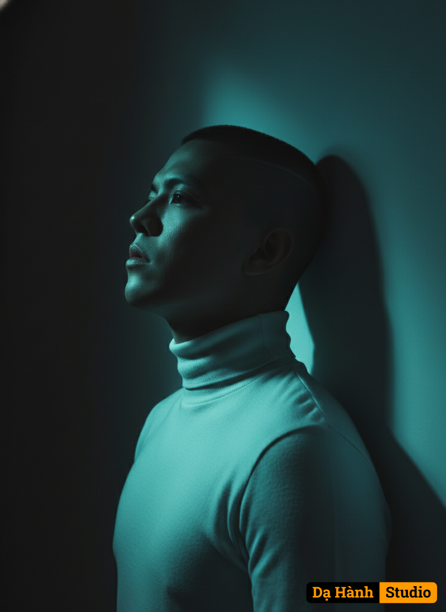

# AI Generated Image

## Details
- **Prompt:** `Using this photo as reference, create a high-resolution studio portrait of the same person, preserving their facial features, hairstyle, and slightly angled profile pose with photorealistic accuracy. The subject is positioned in a left-side profile, gently leaning against a plain wall. Their head is tilted slightly upward, with eyes open but obscured by deep shadows — evoking a sense of introspection and mystery. They are dressed in a minimalist yet refined white turtleneck, serving as an elegant focal point against the dark setting. The environment is dim, illuminated only by a single teal-blue light source cutting diagonally through the darkness. This light sharply sculpts the contours of the face and neck, creating dramatic contrast, with shadows falling across the body and the wall behind. The contact between the subject and the wall produces uneven, deep shadows behind the head and shoulders, enhancing depth and tension in the composition. Darkness envelops the scene, revealing only the areas touched by light. Shot with a cinematic lens (85mm f/1.4), low-key lighting, and edited in an editorial style with cool tones. The image should emphasize emotional depth, dramatic contrast, and visual minimalism, while evoking a sense of intimacy, dreaminess, and timelessness. No text or overlays.`
- **Category:** Nhân vật
- **Source Images:**
  - [View Source](https://raw.githubusercontent.com/lenzcomvth/ImageLibrary/main/Male.png)

## Image
