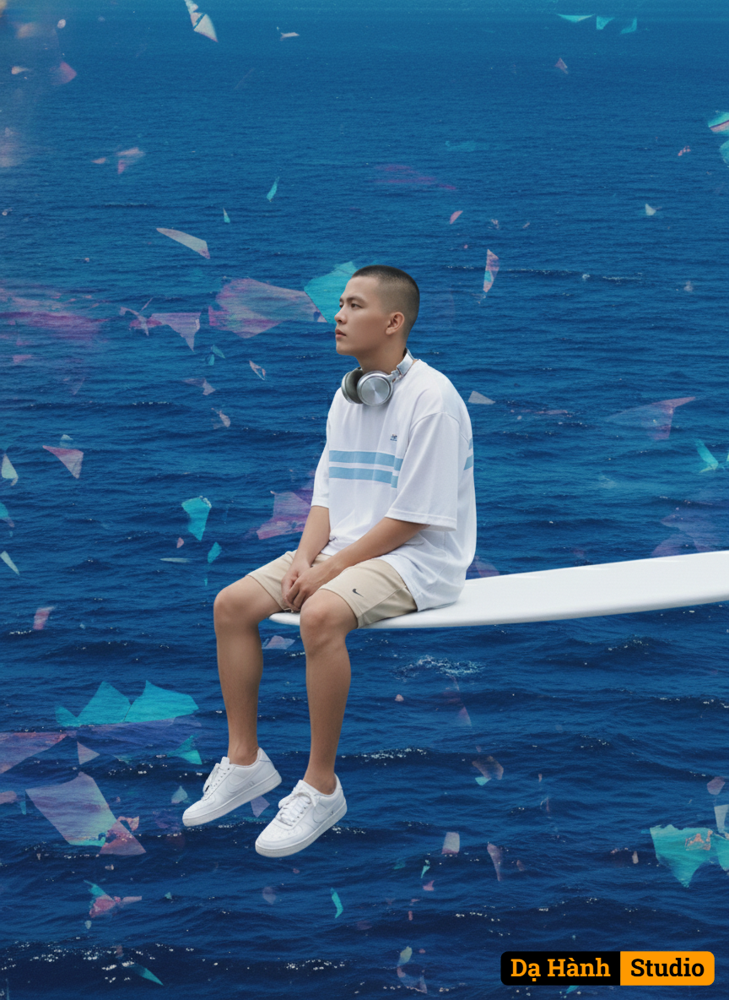

# AI Generated Image

## Details
- **Prompt:** `A surreal, dreamlike album-cover style scene inspired by SZA’s SOS. A vast deep blue ocean fills the entire background, shimmering with surreal hues of indigo, violet, and turquoise, reflecting light like fragments of broken glass. A thin, perfectly horizontal white diving board (resembling a surfboard) extends strictly from the right edge of the frame toward the left, floating as if suspended above the water. Its base is completely out of frame At the far left tip of this board sits a young man with the exact same face and hairstyle as the provided portrait reference (unchanged). He wears an oversized white athletic T-shirt with light blue stripes, paired with beige sporty shorts and clean white sneakers. Around his neck rests a pair of metallic silver over-ear headphones, catching a subtle glow. Pose: seated sideways facing left, legs dangling straight down above the ocean, back straight, both hands resting lightly on his knees. His head tilts slightly upward to the left, gazing calmly as if listening to the infinite silence. Camera angle: A slightly closer framing (medium close-up), focusing on his face and upper body while still showing part of the diving board and the surreal shimmering ocean below. The mood is ethereal, serene, and otherworldly — blending sporty casual realism with dreamlike surreal fantasy.`
- **Category:** Nhân vật
- **Source Images:**
  - [View Source](https://raw.githubusercontent.com/lenzcomvth/ImageLibrary/main/Male.png)

## Image
