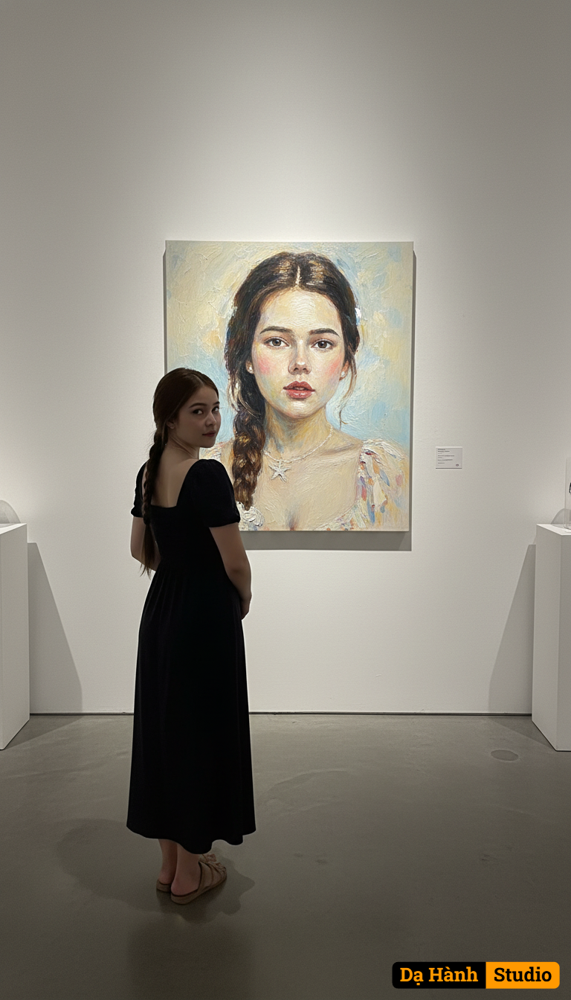

# AI Generated Image

## Details
- **Prompt:** `Using the attached image as a reference for the woman’s face and appearance, create a scene where she is standing in a modern art gallery, viewed from behind, looking at a large oil portrait of herself on the wall. The painting should depict the same woman in a realistic expressive oil style, showing her face and upper body with textured brushstrokes and soft colors. The gallery wall should be clean and white, with gentle spotlighting illuminating the artwork, creating a professional exhibition atmosphere.`
- **Category:** Nhân vật
- **Source Images:**
  - [View Source](https://raw.githubusercontent.com/lenzcomvth/ImageLibrary/main/Female.png)

## Image
