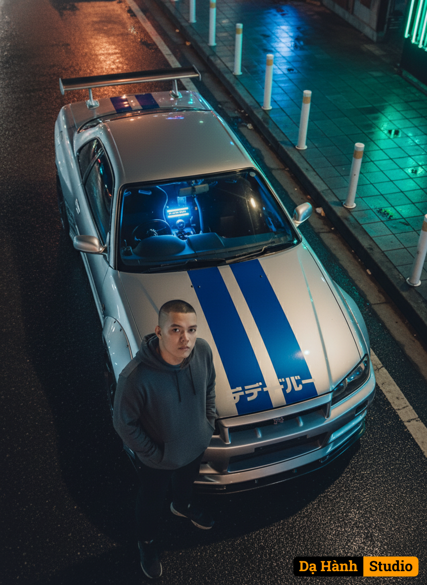

# AI Generated Image

## Details
- **Prompt:** `A photorealistic cinematic night scene inspired by Japanese street racing culture. The main subject is a human figure based on the uploaded reference photo, wearing a gray hoodie, standing confidently and looking up toward the camera from an overhead angle. Next to the subject stands a silver sports car resembling a Nissan Skyline R34, featuring a bold blue racing stripe, full body kit, custom stickers, and Japanese lettering across the hood. From inside the car, a glowing cool blue light radiates outward, illuminating its modified interior. The setting is a dark asphalt curb lined with a white stripe, adjacent to a sidewalk paved with blue tiles and dotted with white poles. The environment is infused with neon city lights in the distance, casting a futuristic and dramatic atmosphere. Wet pavement reflects the vibrant glow, while light bounces across the car’s metallic surface, merging with the reflections of streetlights. The color palette emphasizes neon blue, metallic gray, warm streetlight tones, and subtle green accents, creating strong contrasts and a moody, urban aesthetic. Ultra-detailed, sharp focus, cinematic composition. Image ratio 3:4.`
- **Category:** Nhân vật
- **Source Images:**
  - [View Source](https://raw.githubusercontent.com/lenzcomvth/ImageLibrary/main/Male.png)

## Image
