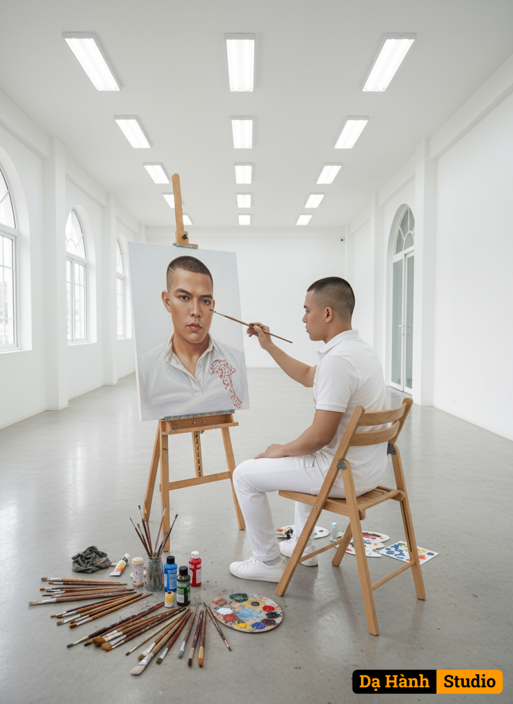

# AI Generated Image

## Details
- **Prompt:** `Prompt 1:A cinematic scene inside a bright, modern art studio with white walls and fluorescent lights. A young man is sitting on a wooden chair, holding a paintbrush, painting on a large canvas placed on an easel. The canvas shows a hyper-realistic portrait of the same man who is painting. Use the uploaded portrait photo as reference for his face, hairstyle, and outfit, keeping them exactly the same as in the reference image. The painting on the easel should clearly depict his own portrait — the same face, hairstyle, and outfit as the man outside the canvas. Around him are scattered brushes, vivid paint palettes, and art supplies, creating an authentic artistic atmosphere. The mood is serene, elegant, and creative, with soft cinematic lighting emphasizing the poetic harmony between the painter and his. Prompt 2:A cinematic scene inside a bright, modern art studio with white walls and fluorescent lights. A young woman is sitting on a wooden chair, holding a paintbrush, deeply focused on painting on a large canvas placed on an easel. On the canvas is a hyper-realistic portrait of the same young woman with the paintbrush. Use the uploaded portrait photo as a reference for her face, hairstyle, and outfit; she is wearing stylish white women’s shoes. The painting on the easel must clearly depict her portrait — with the same face, hairstyle, and outfit as the woman painting it. Scattered around are brushes, a vibrant palette, and painting tools, creating an authentic artistic atmosphere. The overall mood is calm, elegant, and creative, with soft cinematic lighting highlighting the poetic harmony between the artist and her self-portrait.`
- **Category:** Nhân vật
- **Source Images:**
  - [View Source](https://raw.githubusercontent.com/lenzcomvth/ImageLibrary/main/Male.png)

## Image
