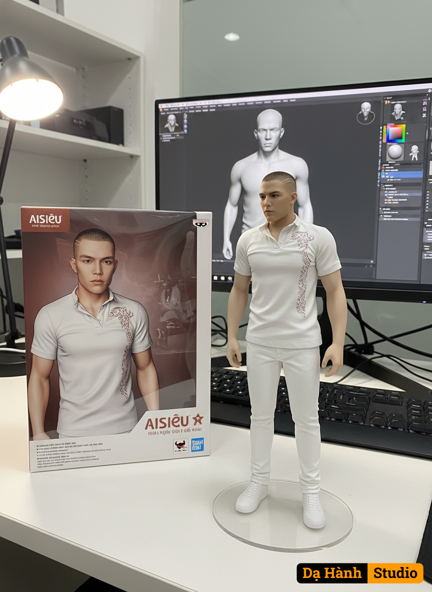

# AI Generated Image

## Details
- **Prompt:** `Use the nano banana model to create a 1/7 scale commercial character figure in the illustration, in a realistic style and environment. Place the figure on the computer desk, using a circular transparent acrylic base without text. On the computer screen, display the ZBrush modeling process of the figure. Next to the computer screen, place a [AISIEU] style toy box printed with the original illustration."`
- **Category:** Nhân vật
- **Source Images:**
  - [View Source](https://raw.githubusercontent.com/lenzcomvth/ImageLibrary/main/Male.png)

## Image
