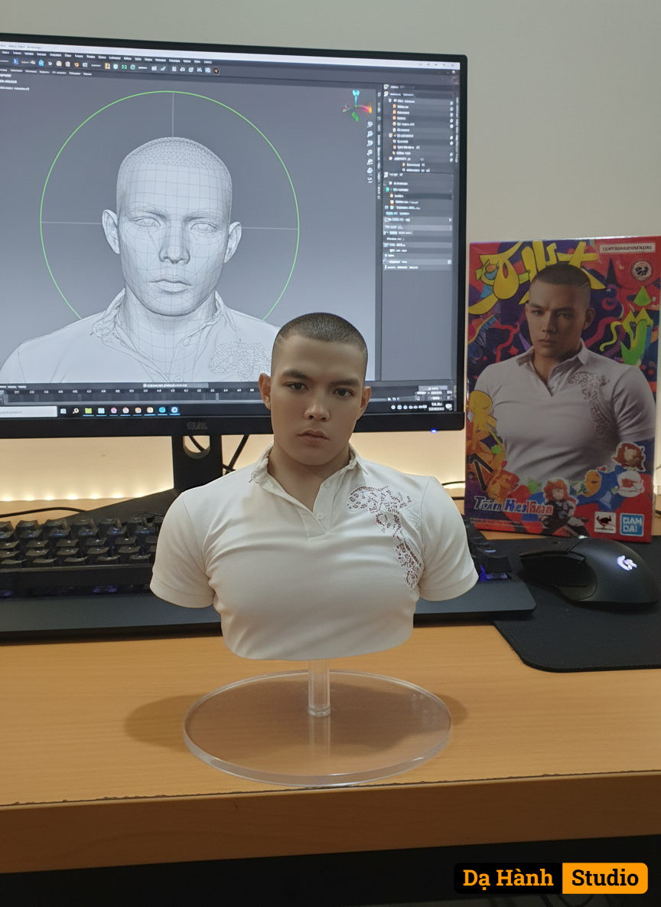

# AI Generated Image

## Details
- **Prompt:** `Use the Nano-Banana model to create a 1/7 scale commercialized figure of the illustrated character, rendered in a realistic style and environment.Place the figure on a computer desk, mounted on a circular transparent acrylic base with no text. On the computer screen, show the ZBrush modeling process of the figure. Beside the screen, include a Bandai-style toy packaging box featuring the original artwork.`
- **Category:** Nhân vật
- **Source Images:**
  - [View Source](https://raw.githubusercontent.com/lenzcomvth/ImageLibrary/main/Male.png)

## Image
