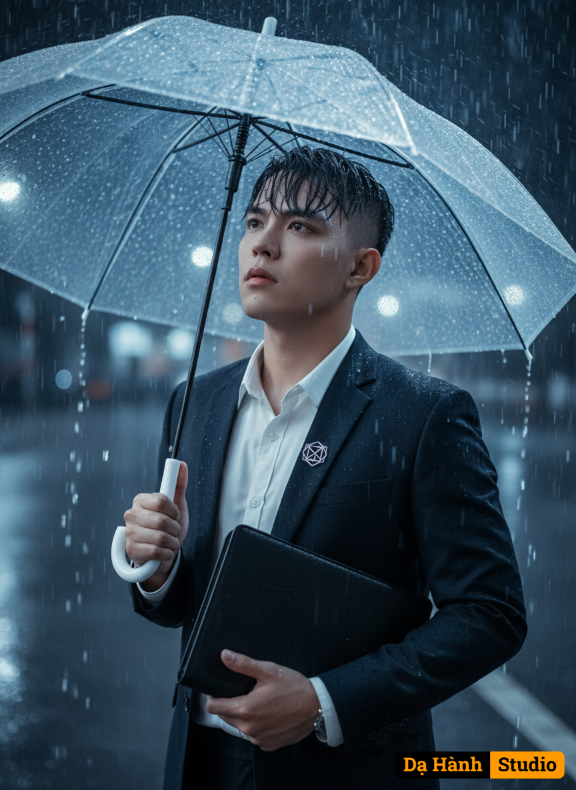

# AI Generated Image

## Details
- **Prompt:** `A cinematic ultra-realistic portrait of a young man standing in the rain, holding a transparent umbrella. His wet black hair falls naturally across his forehead, with raindrops glistening on his face. He wears a sleek dark navy suit, tailored and elegant, with a crisp white dress shirt underneath, unbuttoned at the top for a relaxed yet refined look. No tie is worn, adding a sense of minimalism and modern sophistication. A subtle geometric silver brooch is pinned on his chest. In his other hand, he firmly holds a black leather folder, adding a sense of intellect and purpose. The atmosphere is moody and dramatic, with heavy rain falling all around, but the umbrella creates a soft cinematic shield. The cold bluish color palette, high contrast, and sharp detail make the image look like a still from a neo-noir film. His expression is thoughtful and slightly melancholic, gazing upward as if lost in deep contemplation.`
- **Category:** Nhân vật
- **Source Images:**
  - [View Source](https://raw.githubusercontent.com/lenzcomvth/ImageLibrary/main/Male.png)

## Image
