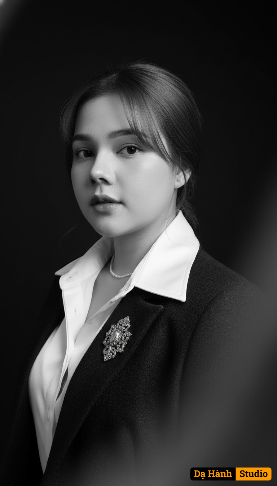

# AI Generated Image

## Details
- **Prompt:** `Face-Lock: 100% | Outfit-Lock: 100% | Hair-Lock: 100%
Create a chest-up, classic studio portrait in monochrome, low-key lighting. Place the subject to the left side of the frame in a 3/4 pose, head slightly turned toward camera, eyes to lens, neutral expression, mouth closed.
Lighting: one large softbox at camera-left 45° slightly above eye level; negative fill on camera-right; deep falloff so the right half of the face and torso fade into shadow, forming a subtle Rembrandt triangle on the shadowed cheek; no rim or background light.
Background & mood: seamless black background; add a faint foreground haze/blur on the right edge to create a soft vignette and cinematic atmosphere; high-contrast black-and-white, deep blacks, luminous highlights, fine film grain, gentle bloom on the shirt collar.
Wardrobe: white silk/satin dress shirt with a crisp wide collar, dark textured jacket, and a decorative metallic brooch on the lapel; no tie, no eyeglasses.
Hair: neat hair with soft side-swept bangs (keep style locked).
Framing & camera: 85mm portrait look at around f/2, eye-level, chest-up crop, negative space to the right.`
- **Category:** Nhân vật
- **Source Images:**
  - [View Source](https://raw.githubusercontent.com/lenzcomvth/ImageLibrary/main/Female.png)

## Image
