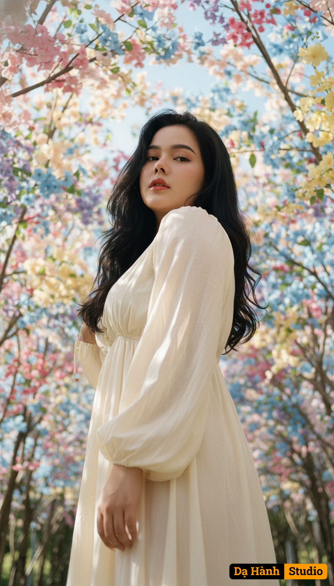

# AI Generated Image

## Details
- **Prompt:** `Use the exact real face from the attached photo, 100% unchanged. A super close-up portrait, shot from an extreme worm's eye view, focusing on a young woman standing amidst a flower forest, with a dreamy, slightly distant expression, eyes looking straight into the lens with contemplation. Her face is illuminated from below, clearly highlighting the jawline, bridge of the nose, and cheekbones from the low angle, creating a sense of power and mystery. Soft, radiant natural sunlight shines from above, creating warm highlights on the top of her head and shoulders, combined with the light reflecting from below, creating a unique transition of light on her face. Natural catchlights sparkle in her eyes. Countless branches of flowers and foliage around the subject are heavily blurred (heavy bokeh effect), leaving only soft, diffused pastel and green color patches, creating a romantic background and focusing entirely on her face. The background is a blurred flower forest or a soft blue sky. The dominant colors are natural, bright yet soft tones, with a harmonious blend of pink, blue, purple, yellow, and green. [The subject has long, naturally voluminous black hair and wears a long, flowing, cream-colored dress made of light, airy fabric]. The photograph is still, artistic, and evocative, suggesting serenity, romance, and closeness to nature. Shot with a vintage film camera (e.g., Contax G2) with an 85mm prime lens, simulating the Kodak Gold 200 film effect. Aspect ratio 2:3, high quality, realistic, romantic realism, dreamy aesthetic, soft focus effect.`
- **Category:** Nhân vật
- **Source Images:**
  - [View Source](https://raw.githubusercontent.com/lenzcomvth/ImageLibrary/main/Female.png)

## Image
