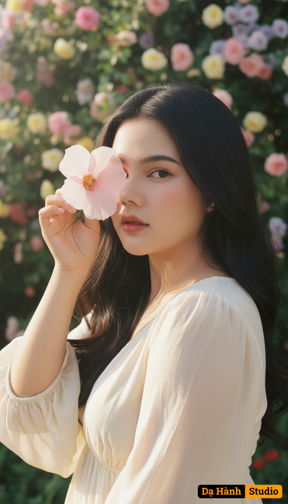

# AI Generated Image

## Details
- **Prompt:** `Use the exact real face from the attached photo, 100% unchanged. A super close-up portrait, shot at eye level, focusing on a young woman with a sensual expression, the visible eye looking straight into the lens with allure. She gently brings a large pale pink flower up to cover one eye, creating a beauty that is both sensual and subtly mysterious. Soft, radiant natural sunlight shines from above, creating warm highlights on the exposed part of her face and the flower, while casting soft shadows from the flower onto the hidden portion of her face, adding depth and drama. Natural catchlights sparkle in the visible eye. The background is a blurred wall of flowers and foliage (soft bokeh effect), with gentle green patches of leaves and numerous pastel-colored flower specks, subtly highlighting the subject and the flower. The dominant colors are natural, bright yet soft tones, with a harmonious blend of pinks, greens, and pastel hues. [The subject has long, naturally voluminous black hair and wears a long, flowing, cream-colored dress made of light, airy fabric]. The photograph is still, artistic, and evocative, suggesting serenity, romance, and closeness to nature. Shot with a vintage film camera (e.g., Contax G2) with an 85mm prime lens, simulating the Kodak Gold 200 film effect. Aspect ratio 2:3, high quality, realistic, romantic realism, dreamy aesthetic, soft focus effect. `
- **Category:** Nhân vật
- **Source Images:**
  - [View Source](https://raw.githubusercontent.com/lenzcomvth/ImageLibrary/main/Female.png)

## Image
