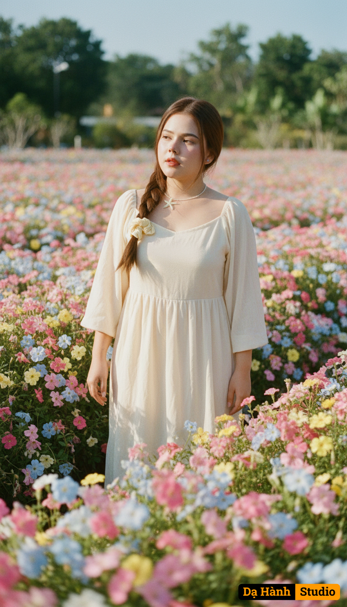

# AI Generated Image

## Details
- **Prompt:** `Use the exact real face from the attached photo, 100% unchanged. A medium shot portrait, photographed at eye level, focusing on a young woman with an indifferent, faraway expression, head slightly tilted to one side, lips slightly parted. She stands amidst a vibrant, richly colored flower garden with countless tiny pink, light blue, pale purple, yellow, and white flowers, forming a dense carpet that completely covers her lower body. Only her upper body is visible, with her lower half entirely hidden by the flowers. Soft, radiant natural sunlight shines from above, creating warm highlights on her shoulders, arms, and a portion of her face, while casting gentle shadows from leaves and flowers onto her upper body, adding depth and a dreamy quality. Natural catchlights sparkle in her eyes. Flowers in the foreground and background are softly blurred (soft bokeh effect), blending into the overall color scheme, highlighting the woman. The background is a vast flower garden or a soft blue sky. The dominant colors are natural, bright yet muted tones, with a harmonious blend of flower colors and greens. [The subject wears a long, flowing, cream-colored dress made of light, airy fabric]. The photograph is still, artistic, and evocative, suggesting serenity, dreaminess, romance, and closeness to nature. Shot with a vintage film camera (e.g., Contax G2) with an 85mm prime lens, simulating the Kodak Gold 200 film effect. Aspect ratio 2:3, high quality, realistic, romantic realism, dreamy aesthetic, soft focus effect `
- **Category:** Nhân vật
- **Source Images:**
  - [View Source](https://raw.githubusercontent.com/lenzcomvth/ImageLibrary/main/Female.png)

## Image
