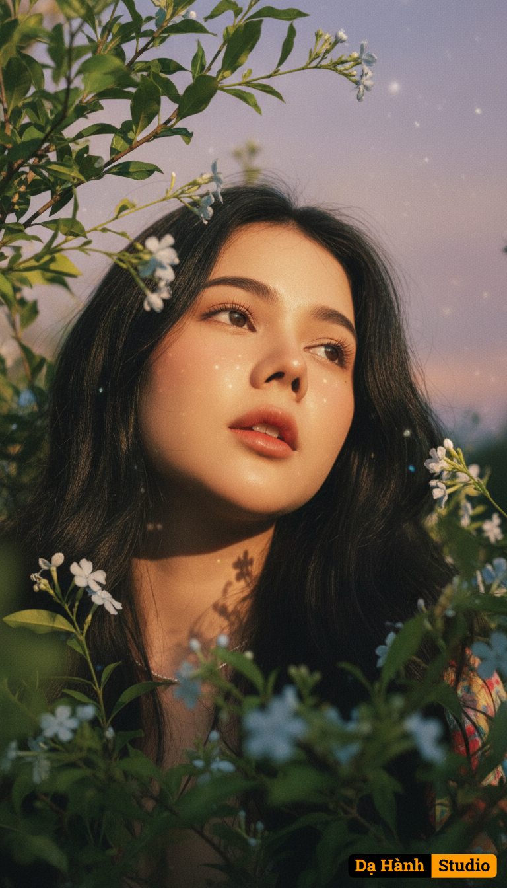

# AI Generated Image

## Details
- **Prompt:** `Use the exact real face from the attached photo, 100% unchanged. A close-up portrait, shot from a worm's eye view, focusing on a young woman with a dreamy, contemplative expression, head slightly tilted back, eyes gazing up at the distant sky, lips gently parted. Her face and hair are surrounded by countless lush green branches and foliage, interspersed with tiny white and light blue flowers, creating the sensation of looking up from an enchanted forest. Soft, golden-hour sunlight shines from above, filtering through the leaves to create dappled, sparkling light spots and soft shadows on her face, highlighting her features and creating an ethereal depth. Natural catchlights sparkle in her eyes. Leaves and flowers in the foreground are softly blurred (soft bokeh effect) to emphasize her face and the light. The background is a gentle blue sky or a blurred, soft orange expanse of twilight. The dominant colors are warm tones of twilight, combined with greens and soft pastel hues. [The subject has long, naturally voluminous black hair]. The photograph is still, artistic, and evocative, suggesting serenity, dreaminess, romance, and closeness to nature. Shot with a vintage film camera (e.g., Contax G2) with an 85mm prime lens, simulating the Kodak Gold 200 film effect. Aspect ratio 2:3, high quality, realistic, romantic realism, dreamy aesthetic, soft focus effect. `
- **Category:** Nhân vật
- **Source Images:**
  - [View Source](https://raw.githubusercontent.com/lenzcomvth/ImageLibrary/main/Female.png)

## Image
