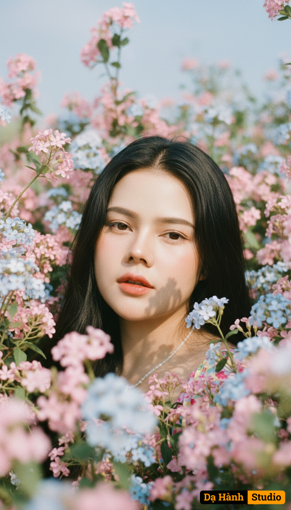

# AI Generated Image

## Details
- **Prompt:** `Use the exact real face from the attached photo, 100% unchanged. A close-up portrait, shot at eye level, focusing on a young woman with a calm, slightly distant expression, eyes looking straight into the lens, soft lips slightly parted. The subject's face and upper body are densely surrounded and covered by countless small flowers and branches in pink, light blue, and pale purple hues, intertwined naturally, creating a sense of being deep within an enchanted garden. Soft, radiant natural sunlight shines from above, slightly off to the side, creating warm, natural highlights on the cheekbones, bridge of the nose, and right side of the forehead, while casting subtle, soft shadows from the foliage onto parts of the face, creating an authentic dappled light effect. Natural catchlights sparkle in the eyes, making them look vivid and alive. Flowers in the foreground and background are softly blurred (soft bokeh effect) to isolate and highlight the face. The background is a soft blue sky or a vague, airy, and open space. The main colors are natural, bright yet soft tones, with a harmonious blend of pinks, sky blues, lavender, and leaf greens, achieving a vibrant yet romantic feel. [The subject has long, naturally voluminous black hair]. The photograph is still, artistic, and evocative, suggesting tranquility, romance, and closeness to nature. Shot with a vintage film camera (e.g., Contax G2) with an 85mm prime lens, simulating the Kodak Gold 200 film effect for its warm, vibrant colors, fine grain, and beautiful rendition of natural light. Aspect ratio 2:3, high quality, realistic, romantic realism, dreamy aesthetic, soft focus effect. `
- **Category:** Nhân vật
- **Source Images:**
  - [View Source](https://raw.githubusercontent.com/lenzcomvth/ImageLibrary/main/Female.png)

## Image
