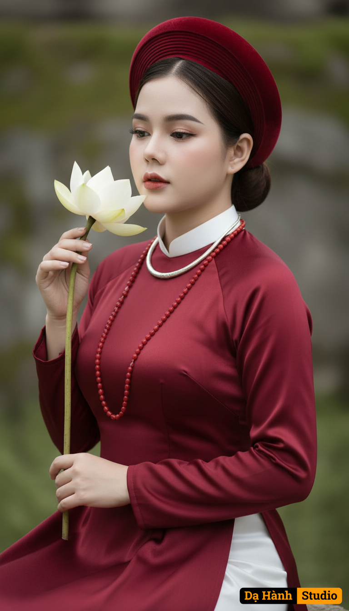

# AI Generated Image

## Details
- **Prompt:** `Giữ nguyên khuôn mặt và thần thái của người phụ nữ trong ảnh đã tải lên, không thay đổi bất kỳ đặc điểm nào.

Tạo chân dung nghệ thuật cổ điển trong trang phục truyền thống Việt Nam, ánh sáng mềm mại và màu sắc hoài cổ, thể hiện vẻ đẹp dịu dàng, thanh tao.

Trang phục:

Người phụ nữ mặc áo dài truyền thống màu đỏ thẫm, chất liệu lụa mịn, được thắt nơ nhẹ ở cổ. Cổ áo trắng nổi bật tạo điểm nhấn tinh tế. Cô đeo chuỗi hạt đỏ dài và vòng cổ bạc ánh kim, gợi phong cách cung đình xưa. Trên đầu đội mấn đỏ nhung tròn cổ điển, tạo vẻ quý phái và thanh lịch.

Tạo dáng/Biểu cảm:

Cô nhẹ nhàng nâng một đóa sen trắng gần khuôn mặt, ánh mắt khẽ nhìn bông hoa với biểu cảm dịu dàng, sâu lắng và tĩnh tâm. Tư thế nghiêng đầu nhẹ, cổ cao, vai thẳng, toát lên thần thái đoan trang và thanh tú.

Trang điểm & Tóc:

Trang điểm nhẹ với làn da sáng mịn, môi đỏ trầm, hàng mi cong tự nhiên. Tóc búi gọn sau đầu, tạo kiểu gọn gàng thanh lịch, làm nổi bật khuôn mặt thanh thoát.

Bối cảnh:

Phông nền mờ nhẹ, tông màu xanh rêu và xám trung tính, làm nổi bật nhân vật chính. Ánh sáng dịu chiếu từ bên hông, tạo độ sâu và hiệu ứng điện ảnh.

Ánh sáng & Màu sắc:

Tông màu chủ đạo đỏ, trắng, xanh rêu trầm, ánh sáng tự nhiên, tương phản vừa phải. Hiệu ứng hậu kỳ tinh tế giúp da mịn, màu áo và hoa sen nổi bật, mang phong vị hoài cổ, thanh tịnh.

Phong cách tổng thể:

Ảnh chân dung cổ điển – nghệ thuật – điện ảnh, lấy cảm hứng từ vẻ đẹp cung nữ xưa, thanh tao và thuần khiết.

Chụp với ống kính 85mm f/1.4, ánh sáng tự nhiên, hậu cảnh làm mờ nhẹ để tôn chủ thể, mang lại cảm giác tĩnh lặng và sang trọng`
- **Category:** Nhân vật
- **Source Images:**
  - [View Source](https://raw.githubusercontent.com/lenzcomvth/ImageLibrary/main/Female.png)

## Image
