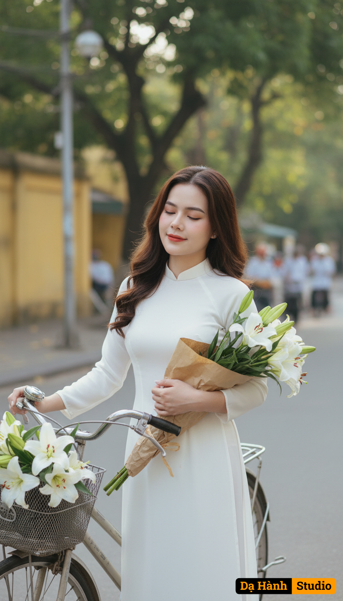

# AI Generated Image

## Details
- **Prompt:** `Keep the girl’s original face and natural expression from the uploaded photo — do not change any facial features.

Create an artistic outdoor portrait in the nostalgic and elegant style of old Hanoi in April.
Outfit: She’s slim, wearing a pure white ao dai with soft flowing fabric, classic and graceful, highlighting her slender and feminine body.
Accessories: She holds a bouquet of white lilies (hoa loa kèn) wrapped in brown kraft paper. Her long hair is softly curled, naturally falling over her shoulders.
Pose/Expression: Standing beside a vintage bicycle full of white lilies, she gently lifts one flower close to her face, eyes half-closed with a serene smile.
Background: Early morning Hanoi street, sunlight streaming through tree canopies, yellow colonial walls and flower vendors blurred behind.
Style: Soft cinematic lighting, pastel tones, shallow depth of field, film-grain texture, romantic and timeless Vietnamese elegance.`
- **Category:** Nhân vật
- **Source Images:**
  - [View Source](https://raw.githubusercontent.com/lenzcomvth/ImageLibrary/main/Female.png)

## Image
