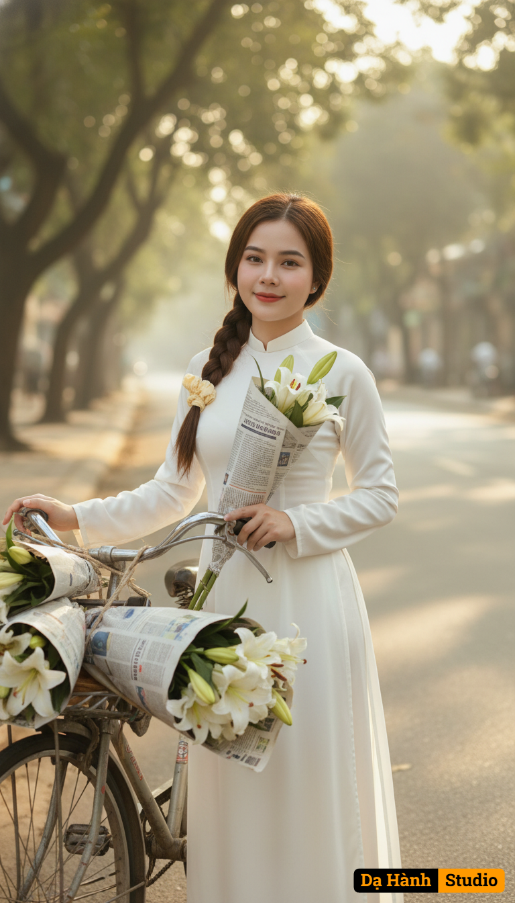

# AI Generated Image

## Details
- **Prompt:** `Bên xe hoa loa kèn trên phố Phan Đình Phùng
(Ghi chú): Dáng người mảnh mai, bên xe hoa đầy loa kèn, ánh nắng vàng xuyên qua hàng cây xanh.
(Prompt tiếng Anh):

Keep the girl’s face exactly as uploaded.

Create a spring street portrait of slim Vietnamese beauty in Hanoi.
Outfit: She’s slim, wearing a white ao dai with long flowing sleeves and silky texture, pure and elegant.
Accessories: Standing beside a vintage bicycle loaded with white lilies wrapped in old newspaper.
Pose/Expression: One hand resting on the bicycle handle, the other holding a lily near her chest, smiling softly with calm, poetic eyes.
Background: Phan Dinh Phung street, lined with green trees, golden morning sunlight filtering through leaves.
Style: Dreamy cinematic tone, golden hue, soft focus bokeh, nostalgic Vietnamese grace`
- **Category:** Nhân vật
- **Source Images:**
  - [View Source](https://raw.githubusercontent.com/lenzcomvth/ImageLibrary/main/Female.png)

## Image
