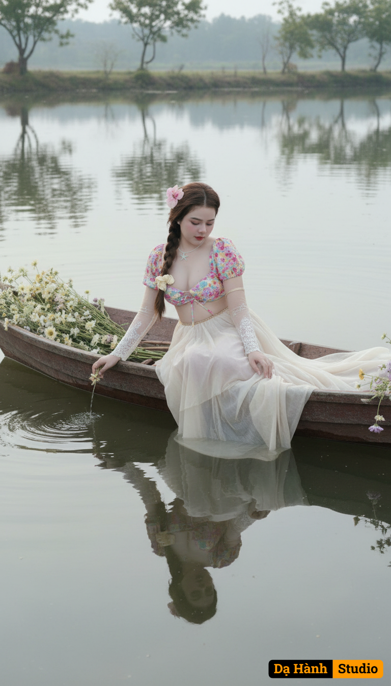

# AI Generated Image

## Details
- **Prompt:** `Ultra-photorealistic 8K cinematic portraits, 3:4 vertical aspect ratio. Use uploaded reference images for 100% precise face alignment— preserve eyes, lips, jawline, hairline, pores, natural skin tone. Lighting: soft diffused daylight, dusk-like or overcast; silvery ambient tones; highlights on water, flowers, fabric. Upscale clarity, no haze, no blur, full texture fidelity.
Flowing light-toned gown, translucent fabric, layered folds, lace cuffs, long sleeves, high collar, fitted waist, sweeping skirt rippling over boat’s edge. Hair in low loose bun, soft framing strands. Makeup delicate, luminous pastel tones. Ambience: Still lake reflecting arching trees. Handmade wooden boat with pale wildflowers (cream, blush, lavender, misty green). Ethereal, impressionist mood. Palette: ivory, silver-gray, soft gold, pale rose, mist green.
Side-angle, full-body on gliding boat. She leans forward, fingertips brushing water, creating ripples. Gown folds trail, flowers spill over boat’s rim. Focus: reflection symmetry, ripples, serene posture. 100% face alignment. Pose 2 — (Half Body) Top-down half-body. She sits upright in boat’s center, head bowed, eyes on water. Breeze stirs hair, floral garlands frame her. Emphasis on lace cuff, hand on wooden edge, diffused light on features. 100% face alignment.
Shoulders-up, side-angle. Faint reflection in water beside face. Calm, wistful expression; eyelashes glint. Background blurs into trees, pastel sky, water. 100% face alignment. Camera: Canon EOS R5 / Leica SL2-S, 85mm f/1.2, ISO 100, f/1.6, 1/200s. Analog LUT, cinematic DOF, pastel tonal grade, film-grain finish, gentle bloom highlights.
Crystal clarity, upscale detail, romantic composition — ethereal vision of stillness, emotion, cinematic precision`
- **Category:** Nhân vật
- **Source Images:**
  - [View Source](https://raw.githubusercontent.com/lenzcomvth/ImageLibrary/main/Female.png)

## Image
