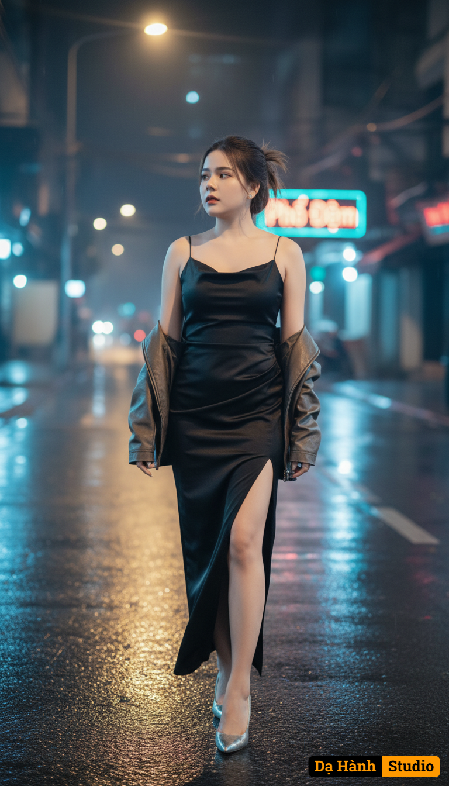

# AI Generated Image

## Details
- **Prompt:** `Phố đêm, đèn mờ giăng giăng lối
Cảm xúc mở đầu: Cô gái cô đơn bước trong ánh đèn vàng nhòe, lạnh lùng giữa thành phố xa lạ.
(likeness fidelity 99%, no modification, no beautify/retouch, no mask/veil; nét nhấn vào mặt, ánh sáng điện ảnh)
Một cô gái hiện đại mang vẻ bất cần, bước một mình giữa con phố đêm sau cơn mưa, ánh đèn đường vàng nhòe phản chiếu trên mặt đường ướt. Mái tóc đuôi ngựa hơi rối, gương mặt lạnh lùng, ánh mắt nhìn xa xăm, vai trần khẽ run trong làn gió đêm. Cô mặc váy lụa đen ôm dáng xẻ tà, khoác nhẹ áo da, giày cao gót mũi nhọn phản sáng dưới đèn. Bên đường là hàng quán khuya mờ ảo, bảng hiệu neon xanh lam và hồng phấn loé sáng. Một tấm biển “Phố Đêm” nhấp nháy giữa sương khói mỏng. Khung cảnh gợi sự lạc lõng giữa vẻ đẹp hào nhoáng.

Camera settings:

{
"lens": "50mm",
"aperture": "f/1.4",
"ratio": "16:9",
"focus": "sharp on face, shallow DOF",
"lighting": "soft yellow streetlights blended with neon blue haze"
}

Style:

{
"quality": "8K cinematic realism",
"mood": "lonely, reflective, sensual, cool-warm contrast",
"color_palette": ["amber", "blue", "black", "silver reflections"],
"render": "hyperrealistic with cinematic lighting diffusion and bokeh reflections"
}`
- **Category:** Nhân vật
- **Source Images:**
  - [View Source](https://raw.githubusercontent.com/lenzcomvth/ImageLibrary/main/Female.png)

## Image
