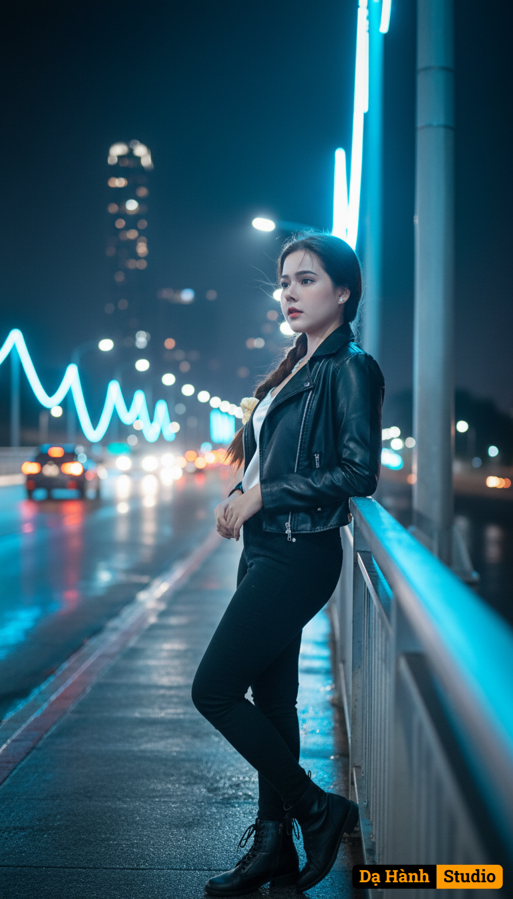

# AI Generated Image

## Details
- **Prompt:** `Màu đèn khuya như đôi mắt người xưa
Cảm xúc hoài niệm, cô gái nhớ về người cũ giữa ánh sáng lạnh.
(likeness fidelity 99%, no modification, no beautify/retouch, no mask/veil; nét nhấn vào mặt, ánh sáng điện ảnh)

Prompt: Cô gái dừng lại bên cầu ánh sáng xanh, đôi mắt nhìn xa xăm phản chiếu ánh đèn thành phố. Trên khuôn mặt là nỗi nhớ người xưa — lạnh lùng mà sâu kín. Cô tựa nhẹ vào lan can kim loại lạnh, hơi nghiêng đầu, ánh đèn neon trắng xanh phản chiếu trong mắt. Trang phục: áo khoác da ngắn đen bóng, bên trong áo hai dây satin trắng, quần skinny đen, giày ankle boots. Gió nhẹ thổi bay vài sợi tóc. Phía xa, dòng xe lướt qua, bóng đèn đỏ lẫn vàng tạo dải ánh sáng dài trên nền phố.

Camera settings:

{
"lens": "85mm",
"aperture": "f/1.2",
"ratio": "16:9",
"focus": "sharp on eyes, blurred city lights background",
"lighting": "neon blue and soft amber bokeh, cinematic rim light on hair"
}

Style:

{
"quality": "8K ultra photorealistic",
"mood": "nostalgic, melancholic, cinematic, soft glow",
"color_palette": ["neon blue", "white", "soft amber", "black leather"],
"render": "dreamlike cinematic lighting with reflective wet surfaces"
}`
- **Category:** Nhân vật
- **Source Images:**
  - [View Source](https://raw.githubusercontent.com/lenzcomvth/ImageLibrary/main/Female.png)

## Image
