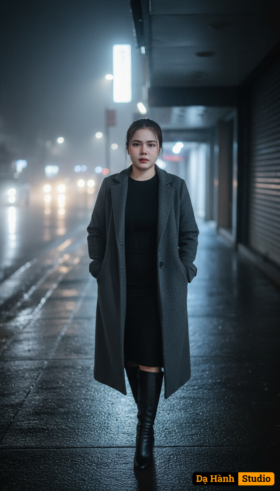

# AI Generated Image

## Details
- **Prompt:** `Người đi trong bóng đêm, nghe hồn mình lặng câm
Cảm xúc trầm lắng, cô gái lạc lõng giữa thành phố quá rộng.
(likeness fidelity 99%, no modification, no beautify/retouch, no mask/veil; nét nhấn vào mặt, ánh sáng điện ảnh)

Prompt: Cô gái bước chậm trên vỉa hè thưa người, đôi tay giấu trong túi áo khoác, ánh mắt vô hồn nhìn xa. Mưa lất phất rơi, ánh đèn xe quét qua khuôn mặt lạnh. Mặt đường loang ánh đèn vàng, cửa hàng đóng kín, bảng hiệu tắt dần. Bóng cô kéo dài trên nền đường ướt, phản chiếu giữa khói sương. Trang phục: áo khoác dáng dài vải dạ xám tro, váy đen ôm, boots cổ cao. Mái tóc đuôi ngựa rối nhẹ, vài sợi bết ướt trên má, ánh mắt bất cần pha buồn.

Camera settings:

{
"lens": "35mm wide angle",
"aperture": "f/1.8",
"ratio": "2:3 vertical",
"focus": "sharp on character silhouette, background blurred",
"lighting": "mixed cool white and amber, cinematic low-key lighting"
}

Style:

{
"quality": "8K cinematic",
"mood": "lonely, reflective, noir-inspired",
"color_palette": ["gray", "amber", "blue haze", "black"],
"render": "rainy atmosphere, street reflections, subtle fog diffusion"
}`
- **Category:** Nhân vật
- **Source Images:**
  - [View Source](https://raw.githubusercontent.com/lenzcomvth/ImageLibrary/main/Female.png)

## Image
