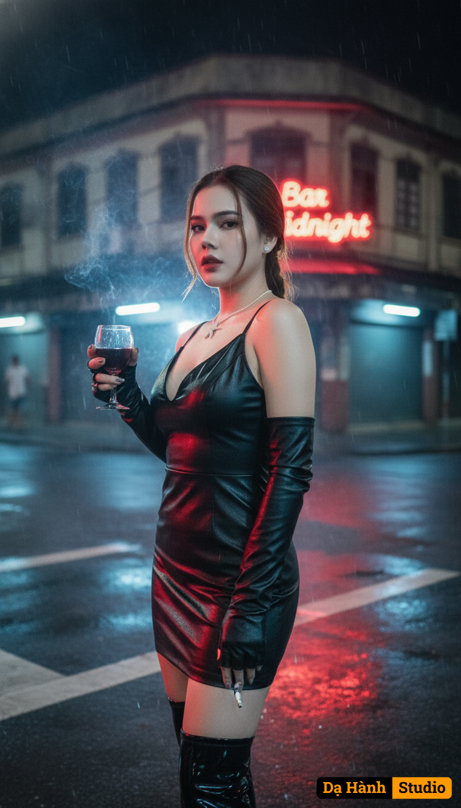

# AI Generated Image

## Details
- **Prompt:** `Phố vẫn hoang vu, phố buồn người lặng lẽ
Cảm xúc khép lại – cô gái đứng lại nhìn phố, ánh nhìn bất cần nhưng sâu trong là trống trải.
(likeness fidelity 99%, no modification, no beautify/retouch, no mask/veil; nét nhấn vào mặt, ánh sáng điện ảnh)

Prompt: Cô gái đứng giữa ngã ba khuya, sau lưng là dãy nhà cũ ánh đèn vàng hiu hắt. Ánh sáng từ bảng hiệu ‘Bar Midnight’ phản chiếu trên làn da sáng mịn và đôi môi khẽ mím. Cô cầm chiếc ly rượu nhỏ, ánh đỏ phản lên gò má, ánh mắt lạnh, bất cần, như thách thức cả thế giới. Xung quanh vắng tanh, chỉ còn khói thuốc, mưa bụi, và tiếng nhạc văng vẳng từ xa. Váy da, cổ V khoét sâu ôm dáng màu đen, găng tay da nửa bàn, boots cao cổ bóng. Tư thế nghiêng người, vai trần khẽ hất ra sau, gương mặt rọi sáng giữa không gian trống.

Camera settings:

{
"lens": "50mm",
"aperture": "f/1.4",
"ratio": "16:9",
"focus": "sharp on face and glass reflection",
"lighting": "red bar neon mixed with cool streetlight tones, rim light on hair"
}

Style:

{
"quality": "8K ultra photorealistic",
"mood": "rebellious, cinematic, cold elegance",
"color_palette": ["red", "black", "silver", "neon blue"],
"render": "high contrast cinematic look, reflections on wet ground, smoke haze diffusion"
}`
- **Category:** Nhân vật
- **Source Images:**
  - [View Source](https://raw.githubusercontent.com/lenzcomvth/ImageLibrary/main/Female.png)

## Image
