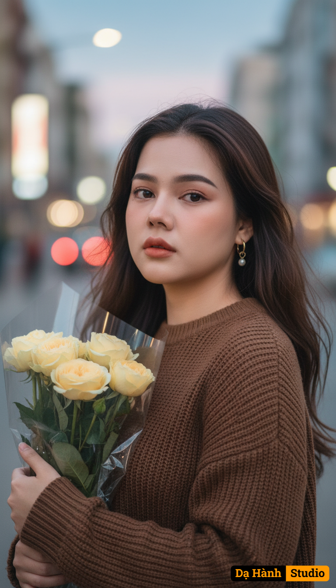

# AI Generated Image

## Details
- **Prompt:** `A hyper-realistic cinematic portrait of a beautiful young woman standing on a city street at dusk, holding a bouquet of soft yellow flowers wrapped in delicate plastic. Her long dark hair flows gently in the evening wind, strands softly brushing her face. The faint glow of the setting sun reflects on her skin, while city lights begin to shimmer in the blurred background.Her eyes are filled with quiet melancholy — distant, wistful, yet tender — as she looks toward the camera with a subtle sadness. The atmosphere feels warm yet lonely, as if she’s lost in a memory. The golden light blends with soft pink and blue hues from the twilight sky, creating a dreamy, cinematic tone.Lighting & Mood: warm dusk glow, bokeh city lights, cinematic low contrast lighting, pastel tones, soft wind movement, filmic depth of field, 85mm f/1.4 portrait, realistic skin texture.Outfit & Detail: simple brown sweater or coat, delicate earrings catching the fading sunlight, bouquet of pale yellow flowers adding softness and warmth to the composition.Makeup: natural peach lips, light blush, warm brown eyeshadow, soft eyeliner emphasizing her emotional gaze.Keywords: melancholy portrait, evening sunlight, cinematic bokeh, emotional realism, windy hair movement, pastel tone color grading, dreamy atmosphere, poetic sadness, soft realism, Korean film mood, warm golden hour, photorealistic 8k, emotional storytelling, fragile beauty, vintage cinematic tone.`
- **Category:** Nhân vật
- **Source Images:**
  - [View Source](https://raw.githubusercontent.com/lenzcomvth/ImageLibrary/main/Female.png)

## Image
