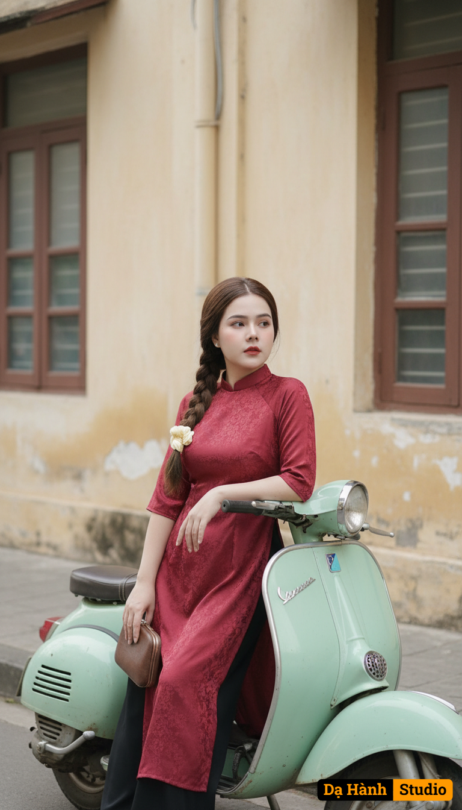

# AI Generated Image

## Details
- **Prompt:** `Giữ nguyên khuôn mặt và biểu cảm tự nhiên của cô gái trong ảnh đã tải lên, không thay đổi bất kỳ đặc điểm nào.

Tạo bức chân dung nghệ thuật mang phong cách hoài cổ Sài Gòn xưa:

Trang phục: Cô gái mặc áo dài lụa hoa đỏ mận họa tiết cổ điển, phối quần đen dài, tạo vẻ sang trọng và đầy hoài niệm. Tay cầm chiếc ví cầm tay nhỏ màu nâu vintage, tăng nét quý phái.

Tạo dáng/Biểu cảm: Cô ngồi nghiêng trên chiếc xe Vespa cổ màu xanh ngọc nhạt, khuỷu tay tựa lên tay lái, gương mặt nhẹ nghiêng, ánh mắt xa xăm, toát lên nét trầm tư và quyến rũ.

Phụ kiện: Chiếc xe Vespa cổ điển là điểm nhấn biểu trưng cho vẻ đẹp Sài Gòn thập niên 60–70.

Bối cảnh: Con phố cổ với bức tường vàng kem và khung cửa sổ gỗ nâu, ánh sáng tự nhiên nhẹ nhàng, tạo không khí cổ điển, thanh lịch.

Phong cách: Retro, lãng mạn và hoài niệm — gợi cảm giác về nét đẹp dịu dàng, tinh tế của người phụ nữ Việt trong không gian Sài Gòn xưa. `
- **Category:** Nhân vật
- **Source Images:**
  - [View Source](https://raw.githubusercontent.com/lenzcomvth/ImageLibrary/main/Female.png)

## Image
