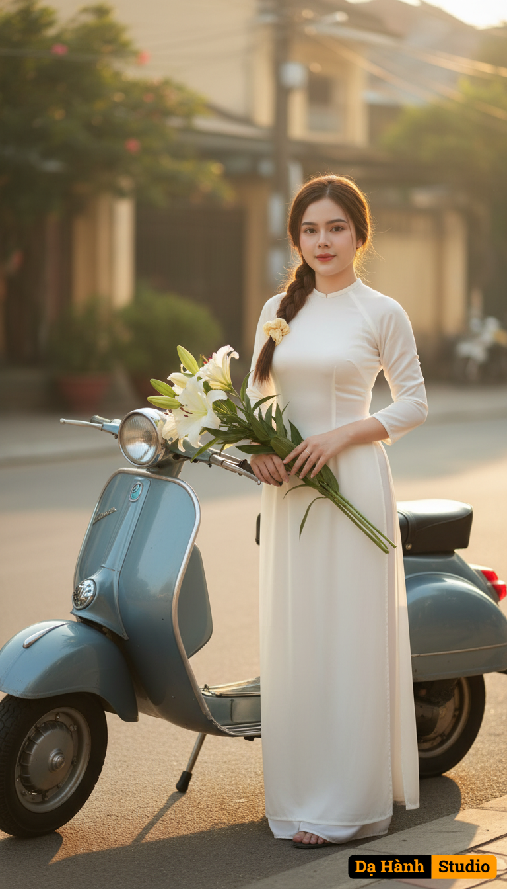

# AI Generated Image

## Details
- **Prompt:** `Giữ nguyên khuôn mặt và biểu cảm tự nhiên của cô gái trong ảnh đã tải lên, không thay đổi bất kỳ đặc điểm nào.

Tạo bức chân dung nghệ thuật ngoài trời mang phong cách hoài cổ và thanh lịch:

Trang phục: Cô gái mặc áo dài trắng truyền thống, chất liệu lụa mềm mại, tôn dáng thanh thoát và tinh khôi.

Tạo dáng/Biểu cảm: Cô đứng tựa nhẹ bên chiếc xe Vespa cổ màu xanh xám, tay cầm bó hoa loa kèn trắng, khuôn mặt nhẹ nhàng, ánh mắt dịu dàng, nụ cười e ấp toát lên nét nữ tính và duyên dáng.

Phụ kiện: Bó hoa loa kèn trắng đặt phía trước xe, gợi sự thanh khiết và tinh tế, hòa cùng vẻ đẹp cổ điển của chiếc Vespa.

Bối cảnh: Con phố cổ rợp nắng vàng nhẹ, ánh sáng buổi sáng sớm phản chiếu trên tà áo dài, tạo không khí trong trẻo, ấm áp và bình yên.

Phong cách: Cổ điển – thanh tao – hoài niệm, tái hiện hình ảnh người con gái Việt dịu dàng trong tà áo dài trắng bên Vespa xưa, mang đậm hồn Việt và nét đẹp Sài Gòn thập niên 60–70.`
- **Category:** Nhân vật
- **Source Images:**
  - [View Source](https://raw.githubusercontent.com/lenzcomvth/ImageLibrary/main/Female.png)

## Image
