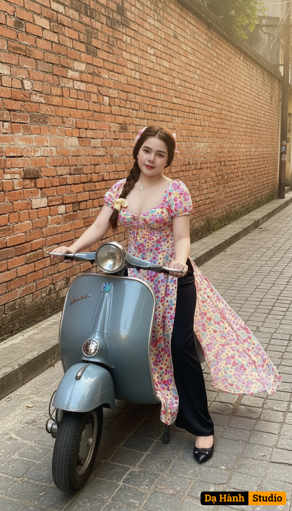

# AI Generated Image

## Details
- **Prompt:** `Giữ nguyên khuôn mặt và biểu cảm tự nhiên của cô gái trong ảnh đã tải lên, không thay đổi bất kỳ đặc điểm nào.

Tạo bức chân dung nghệ thuật mang phong cách Sài Gòn xưa:

Trang phục: Cô gái mặc áo dài truyền thống họa tiết đỏ chấm trắng, kết hợp quần đen cổ điển, tà áo tung bay nhẹ trong gió, gợi cảm giác thanh lịch và hoài niệm.

Tạo dáng/Biểu cảm: Ngồi trên chiếc xe Vespa cổ màu xám xanh, quay đầu mỉm cười nhẹ nhàng về phía ống kính, toát lên vẻ duyên dáng và tự tin.

Phụ kiện: Xe Vespa cổ điển là điểm nhấn, gợi hình ảnh phụ nữ Việt thanh lịch trong những năm 1960–1970.

Bối cảnh: Con phố lát đá và bức tường gạch đỏ cổ kính, ánh nắng vàng dịu chiếu qua, làm nổi bật tà áo dài và không khí Sài Gòn xưa.

Phong cách: Vintage, hoài niệm, tôn vinh nét đẹp truyền thống pha lẫn hiện đại, gợi cảm giác vừa thanh lịch vừa lãng mạn`
- **Category:** Nhân vật
- **Source Images:**
  - [View Source](https://raw.githubusercontent.com/lenzcomvth/ImageLibrary/main/Female.png)

## Image
