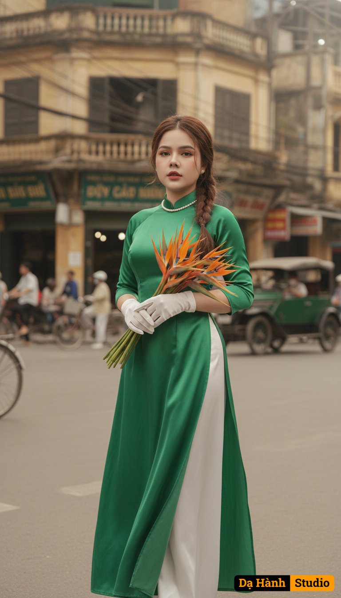

# AI Generated Image

## Details
- **Prompt:** `Giữ nguyên khuôn mặt và biểu cảm tự nhiên của cô gái trong ảnh đã tải lên, không thay đổi bất kỳ đặc điểm nào.

Tạo bức chân dung nghệ thuật mang phong cách hoài cổ giữa phố thị Hà Nội xưa:

Trang phục: Cô gái mặc áo dài lụa xanh ngọc truyền thống, tà áo dài buông nhẹ, phối quần lụa trắng tinh khôi. Tay đeo găng trắng thanh lịch, điểm thêm chuỗi ngọc trai nhỏ quanh cổ, gợi nét quý phái và cổ điển.

Tạo dáng/Biểu cảm: Cô đứng giữa ngã tư phố cổ, tay khẽ ôm bó hoa thiên điểu rực rỡ, ánh mắt nhìn xa xăm đầy tự tin và kiêu sa, toát lên thần thái của người phụ nữ thanh lịch và độc lập.

Phụ kiện: Bó hoa thiên điểu với sắc cam – vàng nổi bật tương phản trên nền áo xanh, tượng trưng cho sức sống và niềm kiêu hãnh.

Bối cảnh: Phố cổ Hà Nội với những tòa nhà kiến trúc Pháp cũ kỹ, bảng hiệu xưa, xe cộ qua lại tạo khung cảnh đậm chất thời gian, gợi không khí vừa hiện đại vừa hoài niệm.

Phong cách: Nghệ thuật – cổ điển – thanh lịch, tái hiện hình ảnh người con gái Việt trong tà áo dài giữa nhịp sống đô thị, mang vẻ đẹp vừa truyền thống, vừa hiện đại và đầy khí chất.`
- **Category:** Nhân vật
- **Source Images:**
  - [View Source](https://raw.githubusercontent.com/lenzcomvth/ImageLibrary/main/Female.png)

## Image
