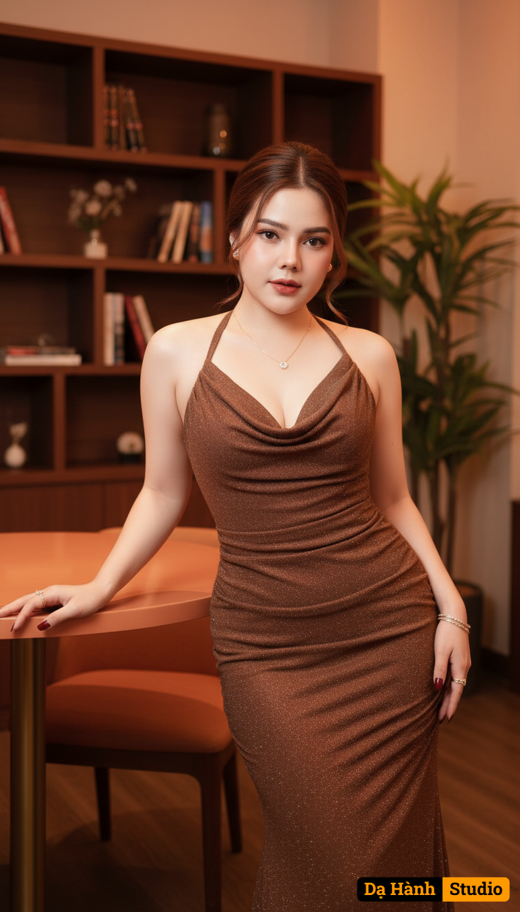

# AI Generated Image

## Details
- **Prompt:** `Ultra photorealistic fashion portrait of the same woman from the reference photo, identity locked (do not alter facial features). A glamorous woman standing indoors, leaning slightly with one hand on an orange round table and the other relaxed at her side. She has fair smooth skin, styled hair in an elegant updo with soft loose strands framing her face. Her makeup is flawless with glowing skin, pink blush, defined eyebrows, long lashes, and glossy red-pink lips. She wears a shimmering brown halter-neck evening gown with a draped neckline, body-hugging fit, and tiny glittering details that reflect the light. Her nails are polished in dark red, and she wears delicate jewelry including small earrings, thin bracelets, rings, and a subtle necklace. Her expression is confident and slightly soft, with a faint smile and inviting eyes. The photo is taken from a straight-on angle at medium height, capturing her upper body and part of her lower body clearly. The background is a cozy, warm-toned indoor lounge with soft lighting. Behind her, there is a wooden bookshelf with books and decorative objects, a tall green indoor plant, and ambient orange-yellow lights creating a moody, elegant atmosphere. The overall lighting is warm and highlights her figure, giving the image a stylish, luxurious, and sophisticated vibe. The background is simple with soft neutral tones, resembling a lifestyle magazine shoot. Ultra realistic, photorealistic details, 9:16 aspect ratio, 8K resolution, highly detailed, masterpiece.
`
- **Category:** Nhân vật
- **Source Images:**
  - [View Source](https://raw.githubusercontent.com/lenzcomvth/ImageLibrary/main/Female.png)

## Image
