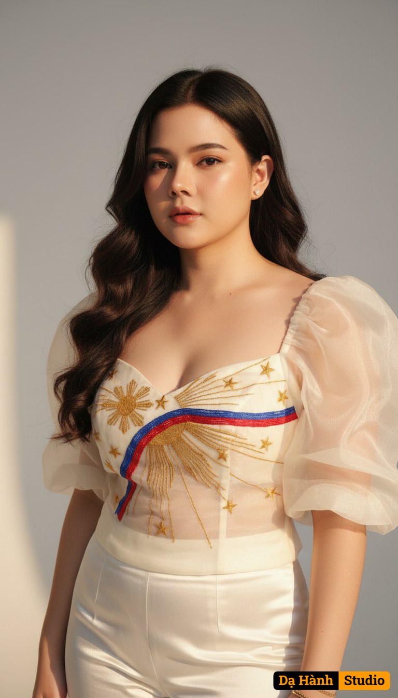

# AI Generated Image

## Details
- **Prompt:** `Using my photo uploaded, copy face 100%, create a high-fashion magazine cover portrait of a radiant Filipina woman exuding grace, intelligence, and national pride. She stands confidently in a minimalist studio, her long wavy dark hair cascading naturally, her expression calm yet empowering. She wears a couture-style modern Filipiniana blouse made of sheer ivory organza with dramatic puff sleeves and intricate embroidery inspired by the Philippine flag — sweeping rays of red, blue, and gold forming a sunburst motif across her chest, accented with delicate stars. The outfit pairs with tailored satin trousers that emphasize modern femininity and strength. The lighting is soft and luminous, with golden highlights that sculpt her face and bring out the texture of the organza fabric. Background is clean light gray with subtle depth, evoking sophistication and timeless beauty. Elegant, empowering, cinematic tone. Keywords: ultra-realistic, 8K, editorial lighting, filipino pride, heritage meets modernity, soft contrast, perfection in detail.`
- **Category:** Nhân vật
- **Source Images:**
  - [View Source](https://raw.githubusercontent.com/lenzcomvth/ImageLibrary/main/Female.png)

## Image
